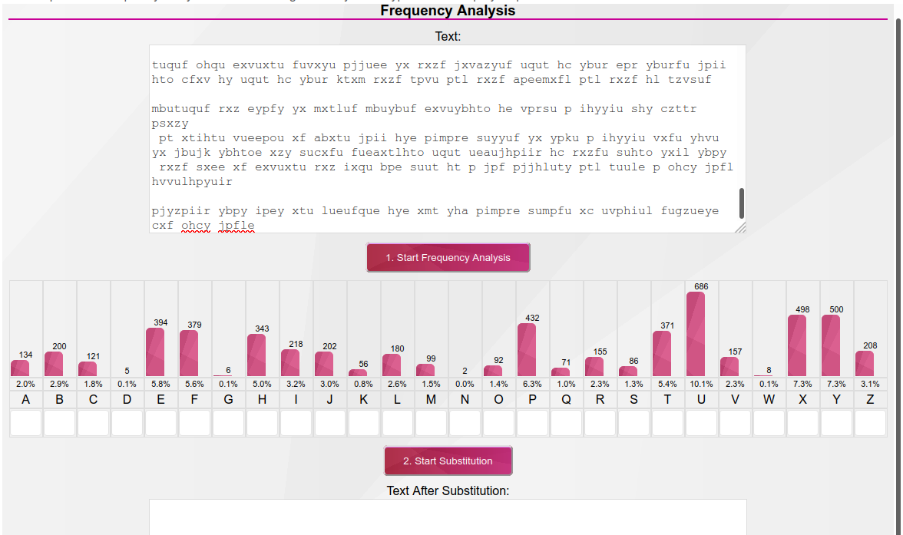
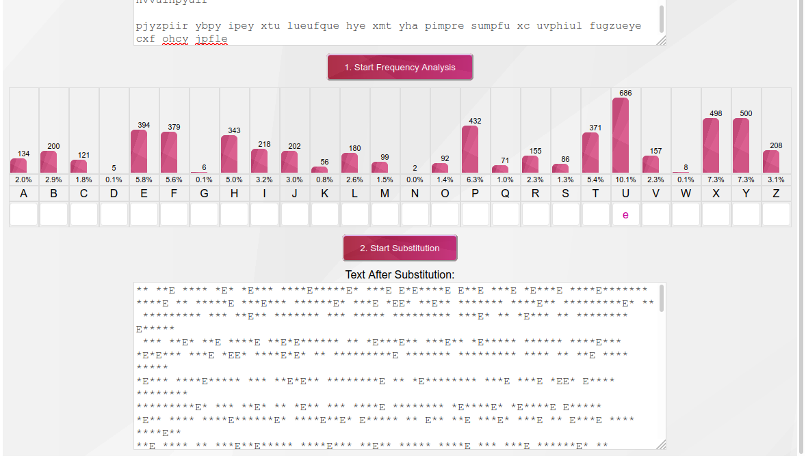
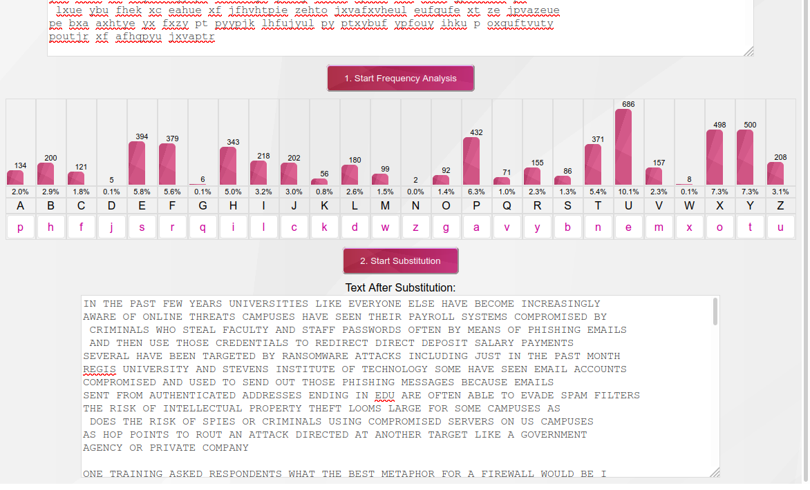

## Introduction to Cryptography
## Ben Holmgren
## benjamin.holmgren1@student.montana.edu
## CSCI 476
## Due 3/30/2021 (noon)

### Task 1: Reflection

* What is cryptography?

Perhaps the easiest way to understand cryptography is to understand the problem
it sets out to solve. Really, this is a problem fundamental to sensitive
communication between different humans. The idea is that two parties may want
to communicate over a network of some form, and inevitably it could be possible
for some unwanted entity to be listening in on the network and intercepting
messages. If these messages are indeed private and sensitive, the goal of
cryptography is to make sure that if someone undesired gets ahold of the
message as it's on the way to its intended target, they can't decipher the
meaning of the message. Ideally, the only entity who should be able to read
the message would be its desired target on the other end of the network.
Effectively, this is cryptography. The study and
implementation of techniques to make sure that a message may only be given to
its intended audience and no one else attempting to gain access to it.

* What problems does it solve?

As touched on above, cryptography at its best solves the problem of a message
intended for a specific target person(s) only going to that intended target
in the end, and no one else. This relates to TONS of problems, a few of which
include the transmission of sensitive military commands, dating as far back as
the Roman empire, famously throughout World War II, and into modern day. 
Most important for our purposes, cryptography solves the problem of keeping
messages and data secure on the internet as they're sent around the world.
Inevitably, it is possible in an internet kind of setting for someone to be able
to listen in to the network. The goal of cryptography is to make sure that
when people listen in on a network, the messages being sent are only able
to be understood by whoever they're intended for.

* What potential issues are there in using and designing cryptography?

There are very many. For starters, it is of the utmost importance
that the intended sender and reciever of messages are actually able to
decipher the messages themselves. Then there is the issue of making the
messages actually secure if someone unintended gets ahold of them.
In the modern cryptographic age, the biggest security threats coincide
with only the intended parties having the keys to a message, and any malicious
parties being hopefully incapable of figuring out the alphabet(s) being used
by means of computational brute force techniques. Not only that, but malicious
parties should not be able to use patterns in messages to their advantage (for
example, techniques like frequency analysis). As with most topics in
computer security, this pretty much means that those in charge of designing
such encryption schemes are as capable as those trying to break them.

* What are some big, important ideas in cryptography?

Fundamentally, we must transform plain text into ciphertext, using some kind
of encryption program. Such a transformation is done using an encryption key
of some kind (that is, how to specifically to manipulate the message in 
the encryption program). Then the ciphertext message needs to be sent to its
intended target. Once recieved, the target must somehow have the correct
decryption key, which can be used in some kind of decryption program related
to the encryption program so that the intended target is able to decrypt the
cipher text to plain text. This is probably the biggest idea in cryptography.
There are many many ways to go about this task. Ideas for how to have the
correct keys include both private and public key cryptography, ideas for the
encryption/decryption programs are nearly infinite, but include the simple
Caesar cipher (easily breakable with brute force), or a random scrambling
of the alphabet, (easily breakable with frequency analysis), or a random
scrambling of the alphabet many times- which is more involved to break. There
are many other ways to go about this that are less tangible, and in that regard
I'll cite a bunch of work in abstract algebra (braid groups, especially- we
haven't talked about them, but they're cool). I think that generally, these
are perhaps the biggest, most important ideas in cryptography.

## Task 2: Substitution Ciphers & Frequency Analysis

Thankfully, the provided text is monoalphabetic, making our task of decrypting
it far easier using frequency analysis. 

To start, I used https://www.101computing.net/frequency-analysis/ to conduct
my frequency analysis. This yielded the following frequencies when copying
and pasting in the provided prompt:

As 'u' was by far the most common letter, we then safely assumed that we should
substitute it for 'e'.

From there, we followed our nose with the other most frequent letters
of the alphabet, using our knowledge of 'e' to uncover the word 'the', 
using occurances of 't' to find the word 'to', and so on until it was a
simple process of finding words that I recognized and could keep filling
in the blanks. This led my to a final result in the following decrypted
message:

``
IN THE PAST FEW YEARS UNIVERSITIES LIKE EVERYONE ELSE HAVE BECOME INCREASINGLY
AWARE OF ONLINE THREATS CAMPUSES HAVE SEEN THEIR PAYROLL SYSTEMS COMPROMISED BY
 CRIMINALS WHO STEAL FACULTY AND STAFF PASSWORDS OFTEN BY MEANS OF PHISHING EMAILS
 AND THEN USE THOSE CREDENTIALS TO REDIRECT DIRECT DEPOSIT SALARY PAYMENTS
SEVERAL HAVE BEEN TARGETED BY RANSOMWARE ATTACKS INCLUDING JUST IN THE PAST MONTH
REGIS UNIVERSITY AND STEVENS INSTITUTE OF TECHNOLOGY SOME HAVE SEEN EMAIL ACCOUNTS
COMPROMISED AND USED TO SEND OUT THOSE PHISHING MESSAGES BECAUSE EMAILS
SENT FROM AUTHENTICATED ADDRESSES ENDING IN EDU ARE OFTEN ABLE TO EVADE SPAM FILTERS
THE RISK OF INTELLECTUAL PROPERTY THEFT LOOMS LARGE FOR SOME CAMPUSES AS
 DOES THE RISK OF SPIES OR CRIMINALS USING COMPROMISED SERVERS ON US CAMPUSES
AS HOP POINTS TO ROUT AN ATTACK DIRECTED AT ANOTHER TARGET LIKE A GOVERNMENT
AGENCY OR PRIVATE COMPANY

ONE TRAINING ASKED RESPONDENTS WHAT THE BEST METAPHOR FOR A FIREWALL WOULD BE I
F THAT FIREWALL WERE A PERSON SO ITS VERY MUCH TO THEIR CREDIT THAT SO MANY SCHOOLS
HAVE INVESTED IN SECURITY MEASURES LIKE TWO FACTOR AUTHENTICATION AUTOMAT
ED BACKUPS OF SCHOOL SYSTEMS AND TRAINING MODULES TO EDUCATE THEIR CAMPUS COMMUNITIES
ABOUT THE RISKS OF PHISHING MALWARE AND WEAK PASSWORDS BUT HAVING SAT
THROUGH FAR MORE THAN MY SHARE OF THESE TRAININGS I AM CONSISTENTLY SURPRISED B
Y HOW MUCH THEY SEEM TO SKIP OVER A FEW ESSENTIAL USEFUL NONOBVIOUS POINTS ABOUT
CYBERSECURITY

FOR INSTANCE ONE TRAINING HAD EIGHT MULTIPLE CHOICE QUESTIONS ONE OF WHICH ASK
ED PARTICIPANTS TO IDENTIFY SOMETHING THAT WAS NOT A REASON FOR THEM TO UNDERSTAND
WHY CYBERSECURITY IS IMPORTANT THE CORRECT ANSWER ATTACKERS LOVE IT WHEN POTENTIAL
VICTIMS UNDERSTAND HOW TO DEFEND THEMSELVES ANOTHER QUESTION ASKED WHETHER
THE STATEMENT I SHOULD USE THE SAME PASSWORD FOR EVERY ACCOUNT WAS TRUE
OR FALSE ANOTHER TRAINING AT A DIFFERENT SCHOOL ASKED RESPONDENTS WHAT THE BEST
METAPHOR FOR A FIREWALL WOULD BE IF THAT FIREWALL WERE A PERSON
CORRECT ANSWER SOMEONE IN THE WORKPLACE WHO STRICTLY ENFORCES ALL RULES AND POLICIES IF
 YOURE GOING TO IMPART EIGHT PIECES OF WISDOM TO EVERYONE AT THE START OF THE SCHOOL YEAR
 THESE ARE NOT THE ONES I WOULD CHOOSE

HERE ARE THE THINGS I THINK EVERYONE ON A COLLEGE CAMPUS SHOULD KNOW FOR THE NEW
 SCHOOL YEAR

STOP COMPLAINING ABOUT NEEDING TO LOG IN TO YOUR EMAIL AND YOUR VIRTUAL PRIVATE
NETWORK WITH TWO FACTOR AUTHENTICATION ACCORDING TO A NEW REPORT FROM MICROSOFT
 IT HELPS PREVENT MORE THAN  PERCENT OF ATTEMPTED ACCOUNT COMPROMISES THAT MEANS
  IT PROTECTS YOUR VPN FROM BEING COMPROMISED AND PROTECTS YOUR EMAIL ACCOUNT
 FROM BEING HIJACKED TO SEND SPAM AND IF YOURE ON THE PAYROLL IT KEEPS YOUR
PAYCHECK SAFE IF ITS ALSO REQUIRED TO ACCESS LIBRARY DATABASES OR COURSE MANAGEMENT
WEBSITES THATS PROBABLY BECAUSE ADMINISTRATORS ARE CONCERNED ABOUT PROTECTING
COPYRIGHTED MATERIALS STORED ON THOSE NETWORKS THATS A VALID CONCERN BUT I
PERSONALLY WOULD PREFER TO PUT AS FEW BARRIERS AS POSSIBLE BETWEEN MY STUDENTS
AND THE ASSIGNED READINGS SO ILL PERMIT SOME COMPLAINING ABOUT THESE RESTRICTIONS

USE THE VPN WHEN YOURE OFF CAMPUS OR NOT AT HOME ESPECIALLY WHEN YOURE SOMEWHERE
WITH UNSECURED WI FI OR IN A FOREIGN COUNTRY WHOSE NETWORKS YOU HAVE REASON
TO MISTRUST IF YOURE TRAVELING TO CHINA OR RUSSIA FOR WORK ASK YOUR UNIVERSITY
INFORMATION TECHNOLOGY DEPARTMENT TO PROVIDE YOU WITH A CLEAN BURNER LAPTOP TO
 USE FOR TRAVEL

DONT RESPOND TO ANY EMAILS OR PHONE CALLS ASKING YOU FOR YOUR PASSWORDS OR OTHER
LOGIN CREDENTIALS YES EVEN IF THEY HAVE YOUR UNIVERSITY LOGO AT THE TOP AND
THEY COME FROM IT SYSTEMS SUPPORT AND THE SUBJECT LINE IS URGENT ACCOUNT EXPIRATION
IF YOURE LEGITIMATELY CONCERNED THAT SOMETHING MAY BE WRONG LOOK UP
YOUR COLLEGES IT HELP DESK NUMBER AND CALL THEM AND ASK DO NOT CALL THE NUMBER
 INCLUDED IN THE EMAIL

IF YOU CLICK ON THE LINKS IN EMAILS TELLING YOU TO LOG IN TO A UNIVERSITY SYSTEM
 ALWAYS DOUBLE CHECK WHEN THE WEBPAGE LOADS THAT THE BEGINNING OF THE ADDRESS
 REALLY IS YOUR SCHOOLS DOMAIN AND THAT IT HAS ESTABLISHED A SECURE CONNECTION
 DONT FALL FOR TUTFSEDU FOR TUFTSEDU FOR INSTANCE IF YOU HAVE ANY DOUBT A
T ALL ABOUT THE LINK OR CANT SEE THE FULL URL IN THE EMAIL OPEN UP A NEW BROWS
ER WINDOW AND SEARCH FOR THE RELEVANT LOGIN PAGE TO BE SURE YOURE NOT BEING MIS
DIRECTED

DONT OPEN ATTACHMENTS THAT YOU WERENT EXPECTING TO RECEIVE OR THAT SEEM EVEN
REMOTELY SUSPICIOUS ESPECIALLY IF THEY HAVE A FILE TYPE YOU DONT OFTEN SEE OR
EVEN DONT RECOGNIZE AT THE END OF THEIR NAMES ZIP RAR EXE JAR OR IF THEY
DONT HAVE ANY FILE TYPE EXTENSION AT ALL IF YOUR SCHOOL USES A WEB BASED
EMAIL PROGRAM LIKE G SUITE FOR EDUCATION OR OUTLOOK WEB APP YOU CAN OFTEN PREVIEW
CERTAIN TYPES OF ATTACHMENTS OR OPEN THEM AS WEBPAGES BEFORE DOWNLOADING THEM ON
TO YOUR COMPUTER

ENABLE FULL DISK ENCRYPTION ON YOUR COMPUTER THIS IS EASY TO DO FOR BOTH MAC AN
D WINDOWS COMPUTERS YOU SHOULD ALSO MAKE SURE IT LOCKS AND REQUIRES A PASSWORD
TO ACCESS AFTER BEING LEFT UNTOUCHED FOR FIVE MINUTES

SET UP A SYSTEM FOR ONLINE BACKUPS OF YOUR HARD DRIVE PICK A CLOUD BASED
STORAGE SYSTEM LIKE DROPBOX BOX ICLOUD GOOGLE DRIVE OR WHATEVER SERVICE YOUR
SCHOOL SUBSCRIBES TO ADDITIONALLY CHOOSE A PHYSICAL OFFLINE BACKUP SYSTEM AN
EXTERNAL HARD DRIVE OR A USB DRIVE AND SET A REMINDER ON YOUR CALENDAR TO CONNECT IT
TO YOUR COMPUTER AND BACK UP EVERYTHING YOU CARE ABOUT TO THAT AT LEAST ONCE
PER WEEK AND YES IDEALLY YOU SHOULD ENCRYPT THAT HARD DRIVE OR USB DRIVE TOO
DONT START THE SCHOOL YEAR WITHOUT FEELING CONFIDENT THAT IF YOUR LAPTOP FELL
INTO THE OCEAN WAS STOLEN OR WAS INFECTED BY RANSOMWARE YOU WOULD BE ABLE TO
START OVER FROM SCRATCH WITHOUT LOSING ANYTHING IMPORTANT YOU MAY BE CONFIDENT
YOU WOULD NEVER FALL FOR ANY MALWARE MASQUERADING AS AN EMAILED CALENDAR INVITE
THOUGH DONT GET TOO COCKY THERE WE ARE ALL FALLIBLE BUT YOUR COMPUTER IS
CONNECTED TO A LARGER CAMPUS NETWORK IMAGINE YOUR MOST GULLIBLE CO WORKER OR CLASS
MATE OR STUDENT YOUR SECURITY COULD BE IN THEIR HANDS MAKE SURE YOURE IN A
POSITION TO RECOVER FROM THEIR MISTAKES AS WELL AS YOUR OWN

NEVER PAY ONLINE EXTORTION DEMANDS IT JUST ENCOURAGES MORE RANSOMWARE ATTACKS
AND YOU MIGHT NOT GET YOUR INFORMATION BACK ANYWAY

NEVER GIVE SOMEONE REMOTE ACCESS TO YOUR COMPUTER EVEN IF THEY SAY THEYRE CALL
ING FROM IT EVEN IF THEY KNOW YOUR NAME AND YOUR PASSWORD AND YOUR ID NUMBER

WHENEVER YOU START TO WONDER WHETHER SOMETHING IS MAYBE A LITTLE BIT FUNNY ABOUT
 AN ONLINE MESSAGE OR PHONE CALL ITS ALWAYS BETTER TO TAKE A LITTLE MORE TIME
TO CHECK THINGS OUT BEFORE RESPONDING EVEN ESPECIALLY IF YOURE BEING TOLD THAT
 YOUR BOSS OR SOMEONE YOU LOVE HAS BEEN IN A CAR ACCIDENT AND NEEDS A GIFT CARD
IMMEDIATELY

ACTUALLY THAT LAST ONE DESERVES ITS OWN TIP ALWAYS BEWARE OF EMAILED REQUESTS
FOR GIFT CARDS
``

