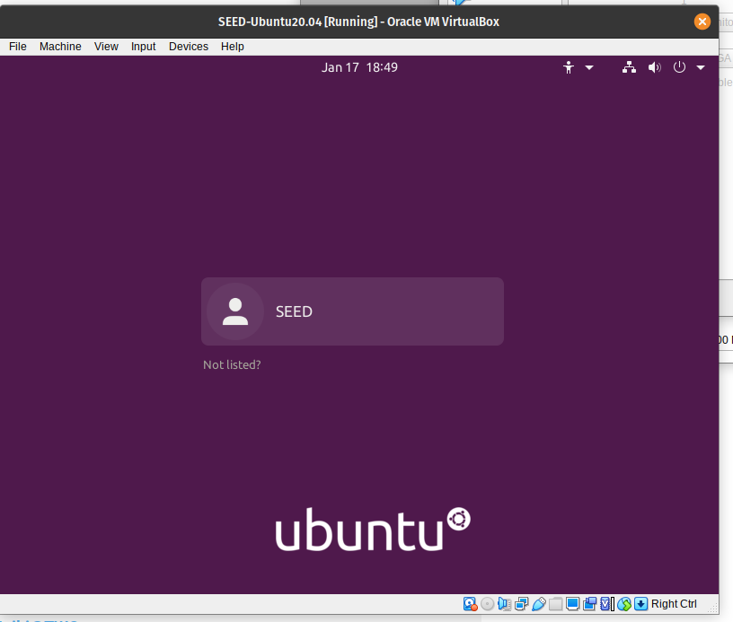
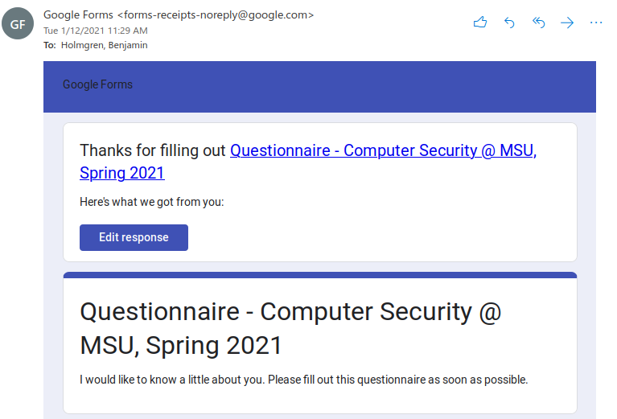

* Ben Holmgren
* CSCI 476
* benjamin.holmgren1@student.montana.edu

1.) 

2.) 

3.) 3 brief lessons from this assignment include:
* A reminder on how to make it so that I don't need to type in my username 
and password every time I push to a repo
* How to set up a VM
* I familiarized myself with the format of the course and the course website 
