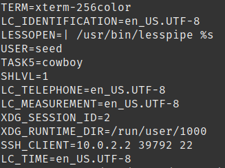

## Lab 01
## Ben Holmgren (f15p655)
## benjamin.holmgren1@student.montana.edu
## CSCI 476
## Due 2/9/2021

### Task 1.1

Use the printenv command to print environment variables. Here is a snapshot of
the findings for this task:

Use printenv on some variable to print just that explicit variable. I chose
printenv PWD:

### Task 1.2

Use export and unset to set or unset environment variables. Namely, if we
choose to run export on a variable, it follows into a child process if one
is to be called. Unsetting a variable gets rid of its assignment.

### Task 2.1

Running myprint.c with just the child process uncommented, we obtain a large
output, which seems on observation to be roughly the equivalent of our
output when running printenv in the shell. A snippet of that output
is as follows:

### Task 2.2

Running myprint.c with the child process commented and parent process uncommented,
we obtain that the output looks upon inspection to be roughly the same. A similar snippet
is included below:

### Task 2.3

Applying the diff command to the two files with saved output, we obtain that no difference
was found between the two files. This means that the ennvironment between
the parent and child processes had all of the exact same variables stored with the same
values.

### Task 3.1

Compiling and running the provided program, we obtain no output. I think this makes sense, since
we're calling execve with NULL as the third parameter, so it's not looking for anything specified.
The output is included:

 

### Task 3.2

Compiling and running the provided program with environ as the third parameter, we obtain 
what appears to be the exact same output as we did when running printenv, though some things near
the end of the output have changed. Specifically, I think these are maybe related to how environment
is being called in the first place, and I think that as a result, we obtain different values
for this one example because the environment has been passed in as a parameter.

### Task 3.3

As mentioned previously, the new program appears to get its environment variables from 
/usr/bin/env, which may differ from the environment variables set at the location from
which the program ends up being called. Indeed, one may observe that these environment
variables often coincide with /usr/bin/env and they include links to the execve program
which aren't found when simply running printenv in the Desktop. Often, these two have the
same environment variables, but not necessarily always.

### Task 4

Indeed, compiling and running these two functions, we find a larger degree of differences
in the environment variables. It seems as though many differences may be found in things like
math and location variables, and addresses of the current environment. I think this makes sense,
since calling system creates a new shell from which the same printenv program is called. But the
difference here between the two calls is that this system call is coming from a child process, whereas
the previous calls weren't. As a result, we find that the environment variables differ a decent amount,
even though the call in the end is basically just coming from the same place (I would presume).

### Task 5.1

Running the provided program shows that the environment variables are in fact being printed correctly, as they
would be with printenv. The only difference is the name of the program executable being run, which makes sense.

### Task 5.2

Done.

### Task 5.3

We export the desired environment variables

And then, running the program, we end up finding that both the new variable we set, and the path variable, are
the ones we set using export. This is exciting, and a little suprising to me. But it seems as though we could
definitely exploit the PATH variable in this way down the road...

### Task 6

Running the provided code after changing its ownership to root and making it set-UID, I could obtain the following
peculiar result. By manipulating the PATH variable, I sent the ls program to my local directory first, before it
could obtain the ls program which is built in. As a result, calling ls ended up not giving me any output, which 
was weird and suprising to me. But this is cool, because we can override assumed programs with ones that
we may be able to customize ourselves by manipulating the Set-UID bit of a program.

Funny enough, since we messed up the ls program's functionality locally, we can't just run ls -al ls in our shell.
Moving back a directory though, we can see that our ls.c program executable is running with root privilege.
### Task 7.1

As per the directions, I created and compiled the desired programs. My work is shown in the provided screenshot.

### Task 7.2

* Running myprog.c as a normal user, we find the following output, which tells us that we've accessed the our
alternate sleep function:

* Running myprog.c as a Set-UID root owned program as a normal user, we gain a different output! Namely, that we are not 
"not sleeping", but rather are indeed sleeping for a second.

* Running myprog.c as a Set-UID root program, after exporting the LD_PRELOAD variable again, we obtain again
the message that I am not sleeping!

* Running myprog.c as a Set-UID program owned by a different non-root account, which I called clyde, gives us "I am not
sleeping!". For me, this is revealing that the important part here may be that we need to export the LD_PRELOAD variable
before executing our call to myprog.c, and this alongside the Set-UID capabilities of the program may be what is the
important thing here, not the ownership of the program.

### Task 7.3

The above results were revealing in that they appeared to portray, at least for me, the importance of exporting
the LD_PRELOAD variable in order for any of the runs to have the output "I am not sleeping!". To test this hypothesis,
one thing we could do is compare our results with and without exporting this LD_PRELOAD variable. Indeed, the results of
this study are revealing with the different user we created:

Thus, the takeaway here seems to be that, when a child process is created (like switching a user, or something
of that sort) the LD variables aren't automatically inherited. But when we specify them in these child processes, 
we obtain the desired output.

### Task 8.1

Assuming the role of Bob, we indeed could compromise the integrity of the system. Specifically, we could use this
code to access something like /etc/shadow, which holds critical information about passwords. If we used this information
to get into accounts, we absolutely could do anything we wanted, including to delete files that we shouldn't. Though
actually doing something of this nature in practice is beyond the scope of the course, we definitely could by 
making the program root owned Set-UID, and then running the program as is illustrated in the screenshot:

### Task 8.2

Changing the system call to an execve call, we actually find that we can still infiltrate the system in the exact
same manner as is done in 8.1. This was surprising to me, since it felt like execve was a little more secure
than system, but indeed, it appears from the provided output that this is still the case:

### Task 9

First, I had to create this /etc/zzz file. I just made a zzz file in that directory, and made it root owned and read only.
Running the provided code after making it root owned and Set-UID, I was able to edit the file.

I think that this makes sense, because of capability leaking, as mentioned in the prompt. The program we used clearly
doesn't clean up the capabilities from the time it's first accessed to the time it's ended, because we access
the program with heightened capabilities and then are able to call other programs while maintaining these same 
heightened capabilities: which we shouldn't be able to do. This is a good exercise in the importance of cleaning up
after oneself!
