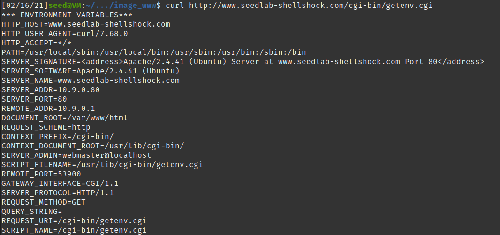

## Lab 02
## Ben Holmgren
## benjamin.holmgren1@student.montana.edu
## CSCI 476
## Due 2/9/2021 (noon)

### Task 1

Design an experiment to test the vulnerability of bash_shellshock vs. normal
bash. This isn't too tricky, just run the command to make a function out of 
a variable, and then tack another command to the end of it and see what happens!

### Task 2.1

Running the getenv.cgi program from the server, we obtain the following
result:

Which allows us to observe that things may be getting sent from our computer to the server. Namely, one might conjecture that the HTTP user agent is a field which may be manipulated. As a result, we may run the following test to verify this:

And indeed, we verify that the HTTP_USER_AGENT field is able to be manipulated from our shell.

### Task 2.1

* Running the "curl -v www.seedlab-shellshock.com/cgi-bin/getenv.cgi" command,
we obtain verbose information about the HTTP request and response, as is told
to us in the prompt. Specifically, we are run through exactly how all of the HTTP get 
methods are working, and the precise variables that are being sent to the server.

* Running the "curl -A "my data" -v www.seedlab-shellshock.com/cgi-bin/getenv.cgi"
command, we obtain a similar result to that of the prior command, except we actually
specify the data that we want sent to the server. This occurs in the User-Agent field.
Otherwise, we obtain the same verbose output as before, with all of HTTP get and received
methods coming from the server.

* Running the "curl -e "my data" -v www.seedlab-shellshock.com/cgi-bin/getenv.cgi" command,
we see a manipulation of environment variables as before, but this time we change the
HTTP_Referer variable.

* Running "curl -H "AAAAAA: BBBBBB" -v www.seedlab-shellshock.com/cgi-bin/getenv.cgi", we observe
that this time we're able to create a new environment variable with the -H command, and specifically we
chose to name this environment variable AAAAAA.

* Certainly, from the given experiment, we could use -A, -e, or -H to inject data into the environment variables 
of the target. I'm not positive which environment variables specifically we'd want to target though. I'd presume 
that maybe the HTTP_referer variable could be important, though if we wanted to create any variable with a 
strategic name to parrot some intended named variable to be used by the CGI, I'd presume we could potentially make
a variable with an identical name but which could cause some sort of mischevous functionality. I could also imagine
that a user ID might matter for some scenarios, but I think the other two options (targeting the '-H' and '-e' 
options) sound more potentially nefarious. However, the whole point of this is that we can execute an unintended
command using this function declaration characteristic of this old version of bash. So it seems like any of these
options (-A, -H, or -e) should all work, because all we need to do is to inject any data into the server, so that
in the end we are able to attach an undesired command with that data. So I'm planning to start by trying -A and
see where that takes me in the next section.

### Task 3.1

I hacked the mainframe!! Using the /bin/cat command carefully inserted within a curl command sent to the server,
I was able to obtain the contents of /etc/passwd without having any privilege to do so. This was successful
with the -A and -e options, but not with the -H options connected with curl. The following are the 
results I found:

### Task 3.2

I got it! This is so cool. I ended up trying both the -A and -H options, for me only the -A option worked.

### Task 3.3

I successfully wrote to a file that I created in the tmp directory, and named the file ATTACK. It's really
starting to set in for me how much damage you could do with this attack!! I've got all the power!!!

### Task 3.4

In the exact same manner as everything we've done so far, we can call /bin/rm and remove the ATTACK file
from the tmp directory.

### Task 3.5

For this task, I wasn't successful in stealing this /etc/shadow file. I would've thought that I'd be able to
steal its contents, or at least read them using the cat command as I did before, but using the cat command as
before I just found an empty output:

And furthermore, attempting to use the cp command to put the contents of the file into another file, I again
was unsuccessful. I used the exact same cat command as before which had worked previously, and I tried to cp
with both the -A and -e options, which were the options that had been working earlier for me. Here's what I tried,
and my empty resulting outputs.

I think this makes sense that I was unable to attain the contents of this file. From 3.2, I've gained the user Id
of the current process, which is 33. I don't believe this Id corresponds to root, which should have Id 0. As a
result, since root is the only thing with permissions for this file, I don't think I can access it. Or if I can,
I can't do so with the standard tricks that have worked up to this point without root access.

### Task 4

I created a reverse shell successfully using 2 terminals! So cool! It took me way longer than it should've to craft
the perfect payload, but I got the magic to happen and I gained a reverse shell.

And here is the payload I used to acquire this shell.

### Task 5

Getting rid of the old version of bash, we are unable to conduct any of the same shellshock attacks. For
every single old command, we just enter into an infinite loop, and no response is ever given. To demonstrate,
here is what I used to shut down the container, thereby reinstating the patched version of bash,
and then what I found when using the /bin/cat command to read the passwords file that I had access to earlier.

And here's my output for the rest of the commands that worked in part 3 (except for stealing /etc/shadow which 
didn't work for either version of bash). All of them ended in an infinite loop.

