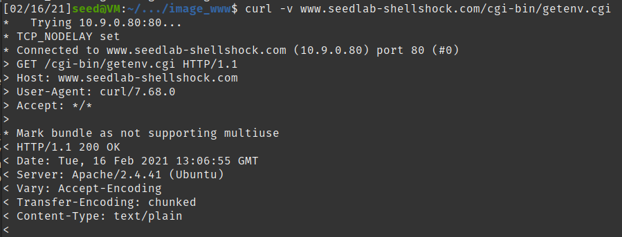

## Lab 02
## Ben Holmgren
## benjamin.holmgren1@student.montana.edu
## CSCI 476
## Due 2/9/2021 (noon)

### Task 1

Design an experiment to test the vulnerability of bash_shellshock vs. normal
bash. This isn't too tricky, just run the command to make a function out of 
a variable, and then tack another command to the end of it and see what happens!

### Task 2.1

Running the getenv.cgi program from the server, we obtain the following
result:

Which allows us to observe that things may be getting sent from our computer to the server. Namely, one might conjecture that the HTTP user agent is a field which may be manipulated. As a result, we may run the following test to verify this:

And indeed, we verify that the HTTP_USER_AGENT field is able to be manipulated from our shell.

### Task 2.1

* Running the "curl -v www.seedlab-shellshock.com/cgi-bin/getenv.cgi" command,
we obtain verbose information about the HTTP request and response, as is told
to us in the prompt. Specifically, we are run through exactly how all of the HTTP get 
methods are working, and the precise variables that are being sent to the server.

* Running the "curl -A "my data" -v www.seedlab-shellshock.com/cgi-bin/getenv.cgi"
command, we obtain a similar result to that of the prior command, except we actually
specify the data that we want sent to the server. This occurs in the User-Agent field.
Otherwise, we obtain the same verbose output as before, with all of HTTP get and received
methods coming from the server.

* Running the "curl -e "my data" -v www.seedlab-shellshock.com/cgi-bin/getenv.cgi" command,
we see a manipulation of environment variables as before, but this time we change the
HTTP_Referer variable.

* Running "curl -H "AAAAAA: BBBBBB" -v www.seedlab-shellshock.com/cgi-bin/getenv.cgi", we observe
that this time we're able to create a new environment variable with the -H command, and specifically we
chose to name this environment variable AAAAAA.

* Certainly, from the given experiment, we could use -A, -e, or -H to inject data into the environment variables 
of the target. I'm not positive which environment variables specifically we'd want to target though. I'd presume 
that maybe the HTTP_referer variable could be important, though if we wanted to create any variable with a 
strategic name to parrot some intended named variable to be used by the CGI, I'd presume we could potentially make
a variable with an identical name but which could cause some sort of mischevous functionality. I could also imagine
that a user ID might matter for some scenarios, but I think the other two options (targeting the '-H' and '-e' 
options) sound more potentially nefarious.

### Task 3

