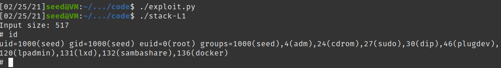
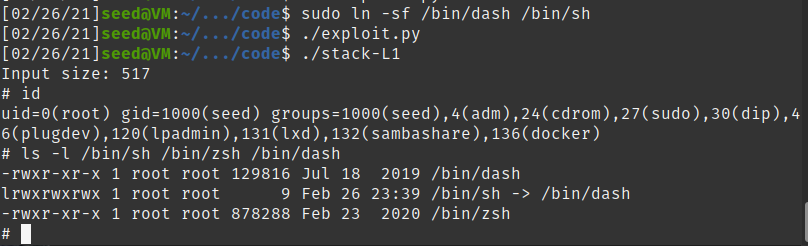

## Lab 03
## Ben Holmgren
## benjamin.holmgren1@student.montana.edu
## CSCI 476
## Due 3/2/2021 (noon)

### Task 1.1

Compiling and running the provided code (after correctly setting up my
environment as per the instructions) yielded the following result:

This indicates that running the provided code gives us a shell. Much of
the environment appears to be the same as it was when the code is
executed, as demonstrated by calling 'ls'. But both programs when run 
give us a new shell.

### Task 1.2

In short, main takes a bunch of code put into a string (the exact code
is dependent on whether we want the 32 bit or 64 bit scenario), turns that
string into a function, and calls the function. Now, one may wonder
what that code actually entails? Importantly, this is assembly to execute
programs. Namely, all of these hex values equate to letters, spelling out 
instructions in reverse. Calling 'man ascii', we can see what each of
these hex values equate to. 

Examining this table, and without getting too in the weeds (as the prompt
asks that we **briefly** describe what main does), we discover that for both
programs, execve("/bin/sh", argv, 0) is being called.

### Task 2.1

Running the provided commands, we can find that the distance from the start of
the buffer to ebp is precisely 108. Knowing that the return value lies directly
above the address for ebp, we obtain that the distance between the start
of the buffer and ebp is 108 + 4 = 112.

### Task 2.2

We know that the return address is 4 bytes away from the address where ebp
is located. From before, we found that ebp was located at 0xffffcd88, so then
the return address we would expect to be located at 0xffffcd88 + 0xffffcd04 = 0xffffcd8c (just by googling
this computation). 

But this isn't the whole story. We were using the debugger
which makes the stack deeper than it would be if we were just running the 
program normally. By running the provided code to test the stack layout, we
find the address of a variable normally:

And then running the same code in the debugger, we find the same variable's
 address, while in the debugger, allowing us to estimate the cushion the
debugger is adding to the stack.

Then, adding this final cushion to the address we found earlier in the debugger,
we have a good estimation of what return address to use in our attack. Namely,
we want to use ffffcd8c + 0x144 = 0xffffced0.

Then, we use the same shellcode as was used in the 32-bit system in the
prior example. We know that the buffer is of length 517, so we want to 
inject in this shell code right at the end of the buffer, giving us
that ``start = 517 - len(shellcode)``

As described in 2.1, the offset we will use is 112. Filling in each of
these values in their specified location in exploit.py, running exploit.py
and finally stack-L1, we successfully obtain a root shell!

And, to reiterate, here is the code that I ran in exploit.py
which let me achieve such a feat:

### Task 3

Succinctly, our approach here for a buffer overflow attack without
knowing the size of the buffer beforehand is to spray the return
address everywhere. I say this tongue in cheek, but we're going to just
insert a new return address everywhere that we had NOP's earlier
leading up to our new return address as before, but not above this new
address in memory. With the knowledge that the buffer may be of size
anywhere between 100 and 200 bytes, and knowing that the value stored in
the frame pointer must always be a multiple of four, we can just insert a
return address at every 4th byte from byte 100 to 200 in our content string.

Doing so, we're able to successfully conduct another buffer overflow attack:

For the sake of clarity, all steps as before in task 2 were the same, except we 
disregarded the offset value we obtained from directly looking
at where the buffer began and ended in memory. We then built up the content
string as follows, placing a return address at every 4th byte from bytes
100 to 200:

### Task 4.1:

First, I ran the a32.out and a64.out executables without the
assembly that makes the setuid(0) sys call. Unsurprisingly, 
I obtained a shell, and this shell did not have root privilege
for both the 32 and 64 bit versions. Here is what I ran:

This makes sense to me- this is the same thing as invoking
a shell without any sort of heightened privilege or any kind of
trickery using a buffer overflow, so of course we have a seed
shell.

Next, I ran the a32.out and the a64.out executables with the 
setuid(0) call invoked. I again found that the resulting
shell did not have root privilege. This too makes sense to me,
since, though the program invoking the shell itself is root owned, 
we haven't done anything special to actually gain root privilege
in the executed shell. Running a root owned program is an
entirely different thing than running a root owned program
and obtaining root access.

Here is my output for this subtask, with evidence that
I indeed obtained a shell with only seed access again:

To gain root access, I think we'll need to do something 
like overflowing a buffer! I say this because the shell
with this countermeasure can detect that the effective
UID isn't the real ID. However, if we overflow a buffer,
this should go out the window entirely, since the shell
shouldn't have any reason to detect the effective UID doesn't
actually equal the real UID.

### Task 4.2

I put on my hackerman shoes and successfully breached the mainframe.
As supporting evidence, here is my output when doing such a thing
(directly after invoking the correct shell, too):

I was able to achieve such a feat by simply adding in the assembly
to invoke setuid(0) at the start of my shellcode. I did this for
a 32-bit setting, as this is what we've been doing so far. I obtained
this additional line of code from the shellcode/ folder. This magical
payload was constructed as follows:

### Task 5.1

### Task 5.2

### Task 6.1

First, we turn the stack guard back on by commenting out the original
flag in the Makefile:

Next, we remake the executables, and run our attack that was used in
the first buffer overflow attack we carried out. This ends up being
unsuccessful. We are prompted with the message that "stack smashing
detected" and the program terminates. The output is as follows:

### Task 6.2

Next, we make the stack non-executable. Since we know for sure that
the earlier attack won't work if we comment out the original flag in
the Makefile for the stack guard, we reinstate the flag blocking
the stackguard, and instead instate the -Z noexecstack. This makes
our attack not possible and results in a seg fault:

Now, I performed this task without fully reading the prompt for the
lab. I'm actually supposed to run the code in the /shellcode directory
with a non executable stack. I'd expect to find an identical result
as was found for my unsuccessful attack above. Indeed, this is the
case: 

