## Lab 04
## Ben Holmgren
## benjamin.holmgren1@student.montana.edu
## CSCI 476
## Due 3/9/2021 (noon)


### Task 1
After successfully logging in with root privilege, we can call
'select * from credential;' to obtain the list of the users in the
database with all of their hashed passwords.

Running 'select * from credential where Name='alice';' we get the 
password of Alice alone. This is demonstrated by the following output:

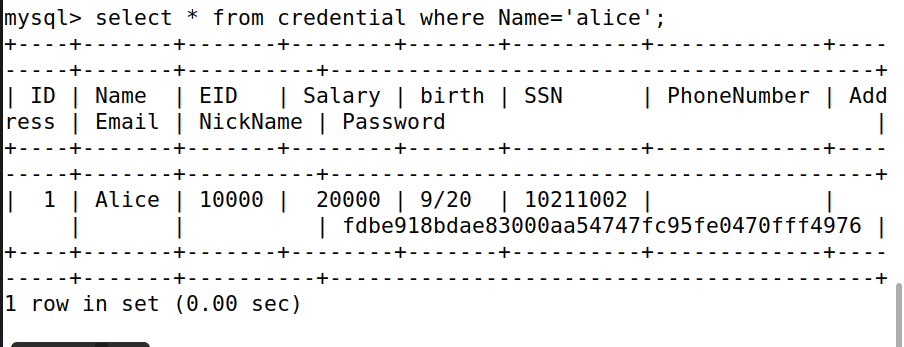

### Task 2.1
To do this, all we need to do is comment out the rest of the line of input
in the actual code that's being run. We can succeed with this task by simply
typing in the user name that we know, followed by a closing quotation mark
and then the start of a comment. In other words, the following input:

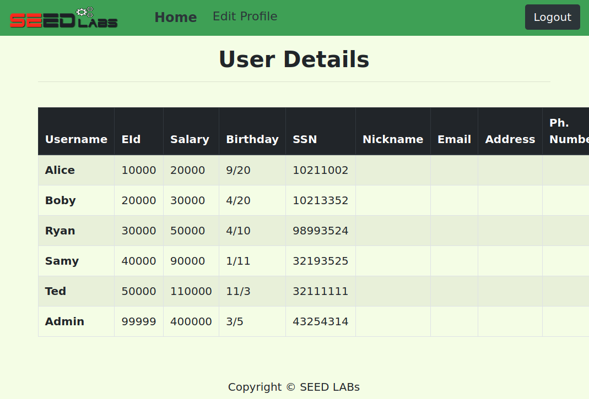

The end result of this input gives us the admin account privilege in the
database, which is as follows:

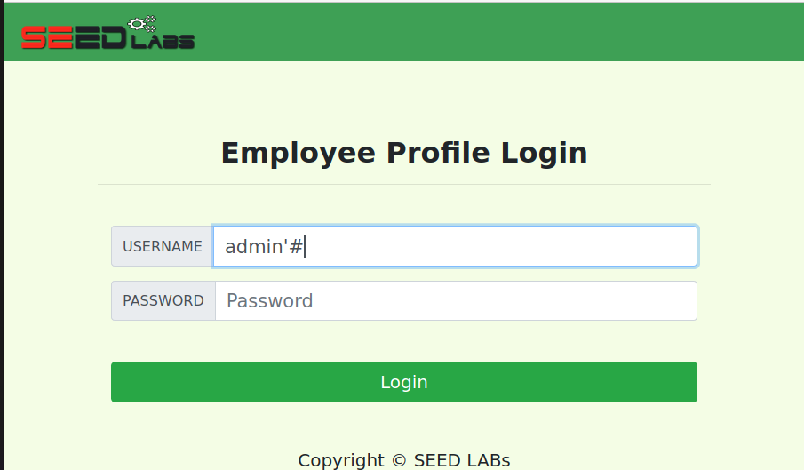

### Task 2.2

To achieve the result of task 2.1 but without using the login page, we can
just modify the given curl command so that the end of the HTTP GET request 
just comments out the password. Saving the output in an html file, we get the
same output, which we can visit by just opening this html file after delivering
our payload. Enough said, here's the payload:

```
curl 'www.seedlabsqlinjection.com/unsafe_home.php?username=admin%27# > task2.html
```

And here's the resulting html output file once we open it.

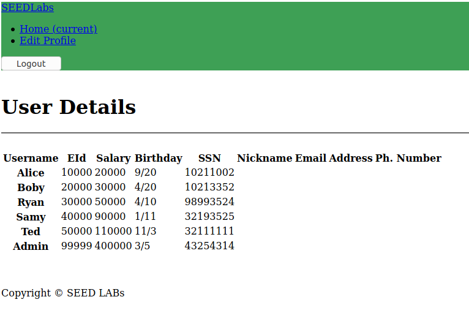

### Task 2.3

The idea here is to tack on another command after our initial successful command
in our sql injection. However, this actually isn't possible, as is mentioned
in the spoiler alert in the lab. For proof, take the following input:

```
admin'; update credential set Salary=99999999 where name='Alice';#
```

Based on what has worked in the past, this should also work if one were able
to tack on sql commands after each other. Indeed, one may verify that this is all
correct syntax, and the same thought holds from before, that we take a command, end
that command, and then comment out the rest of the line. Only this time, we tried
to squeeze another command after the first command, before commenting out
the rest of the line of code that's processing the intended input. Here's evidence
that the code that (to the best of my knowledge) should work actually doesn't since
the prepared statement countermeasure is in place:

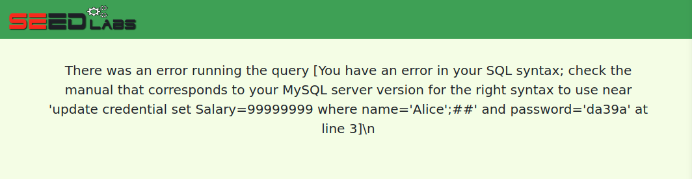

### Task 3.1
After logging in as Alice, if we go into the edit profile page, we can
do some serious damage. Namely, we can just add in a modification
to our salary directly inline with anything we'd like to change,
while keeping the input syntax consistent with the rest of the statement
in the underlying sql code being run. To make Alice rich, we may run
the following payload in her edit profile page:

```
Allie', Salary='99999
```

Inputting this code into the nickname prompt of the edit profile
page gives us the following result:

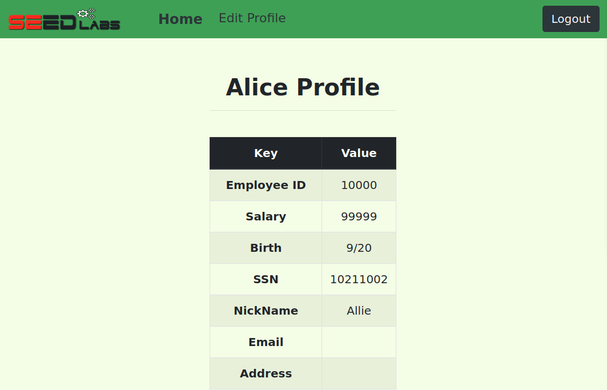

### Task 3.2

We're going to want to do something similar as we did above, only this
time we want to modify a different profile instead of that of Alice.
Well, we can just hardwire the program to operate on Samy's profile
instead of Alice's, since the specification that that the modification
be made on Alice's profile is made at the very end of the statement in
the code. Then, after hardwiring the statement to operate on Samy's 
profile, we can comment out the rest of the statement to get the
following payload:

```
Samy', Salary='1' where Name='samy';#
```

Indeed, we find that nothing changes in Alice's profile:

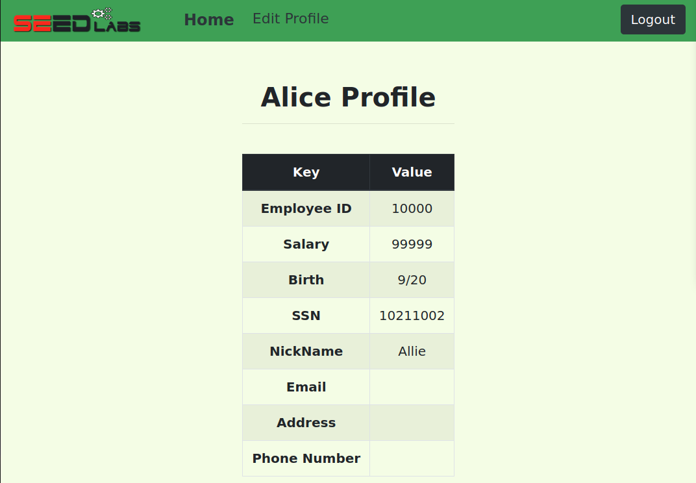

But logging out and getting into Samy's profile to inspect it, 
we find that Samy's paycheck has indeed taken a serious hit:

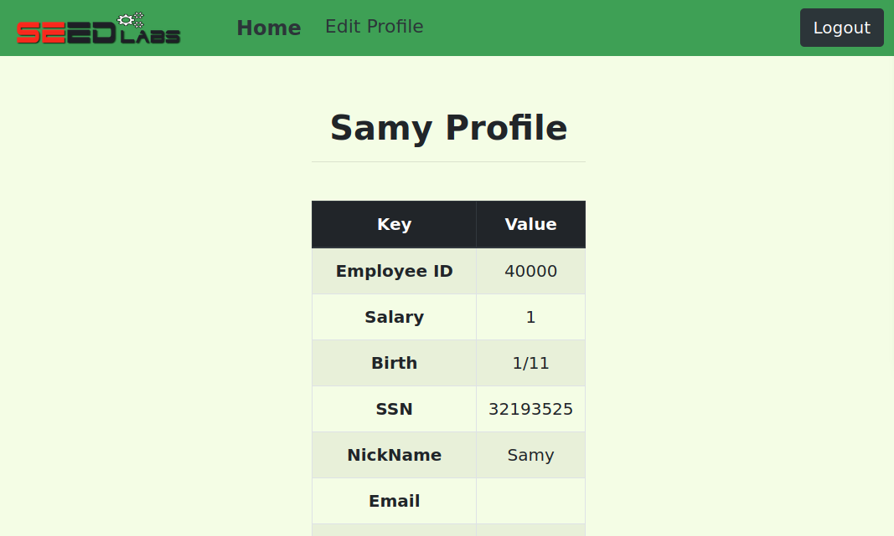

### Task 3.3

Ok, to change Samy's password, we can do virtually the same thing
as we did in 3.2, only modifying the password variable. Now,
it's worth noting that we can't *only* change the password variable
to what we desire though, because the password gets encrypted by this
SHA1() method. So, if we want to change the password, we need to 
change this variable within a call to the SHA1() method.
This yields the following payload:

```
Samy', password=SHA1('alicepassword') where Name='samy';#
```
Running the payload in Alice's account gives this output:

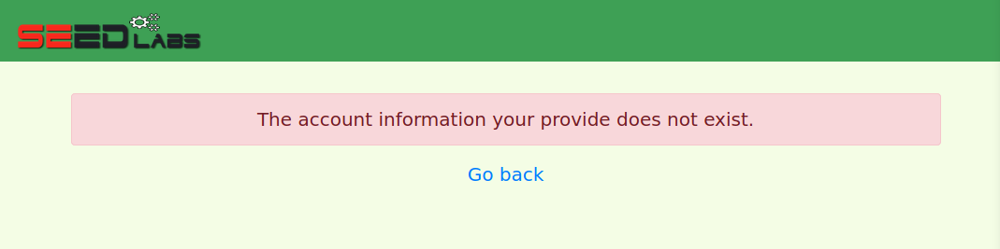

That's not super informative. But we can see what the passwords of
each of our users are just by looking at the table we referenced in
task 1:

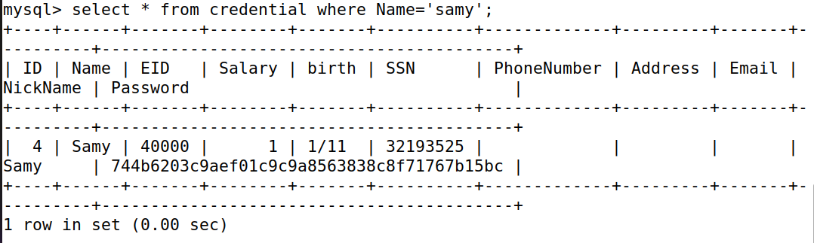

Alright, well, I can't translate the encrypted version of the password
off the top of my head, but I can just test what the value of
SHA1('alicepassword') should be by running:

```
select(SHA1('alicepassword');
```

And indeed, we find the output:

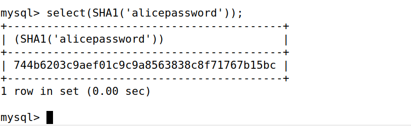

Just upon quick examination, we can tell that this is the exact same
value as is held in Samy's password. So our injection worked, and Samy
has a password that we know!

### Task 4

For me, this part could be finicky. After a decent amount of time, I
arrived at the following code which replaces the dangerous section of 
code previously located in 04_sqli/image_www/code/defense/unsafe.php. 

```
$stmt = $conn->prepare("SELECT id, name, eid, salary, ssn 
                        FROM credential
                        WHERE name = ? and password = ? ");

// Bind parameters to the query
$stmt->bind_param("ss", $input_uname, $hashed_pwd);
$stmt->execute();
$stmt->bind_result($id, $name, $eid, $salary, $ssn);
$stmt->fetch();

if ($stmt->num_rows > 0) {
  // only take the first row 
  $firstrow = $stmt->fetch_assoc();
  $id     = $firstrow["id"];
  $name   = $firstrow["name"];
  $eid    = $firstrow["eid"];
  $salary = $firstrow["salary"];
  $ssn    = $firstrow["ssn"];

}

```

We end up replacing the entire vulnerable section with this. Specifically,
that includes just the couple lines which I've included:

```
$result = $conn->query("SELECT id, name, eid, salary, ssn
                        FROM credential
                        WHERE name= '$input_uname' and password= '$hashed_pwd'");
if ($result->num_rows > 0) {
  // only take the first row 
  $firstrow = $result->fetch_assoc();
```

Where anywhere the variable 'result' is used we switch it with 'stmt', and
otherwise proceed with the code given to us in the prompt, only with input
variables corresponding to our database.

Then indeed, the attack that we've used the entire time is no longer successful,
but we're still able to access our database if we provide the correct login.

As an aside, after figuring this out and then going back the next day to take
screenshots, for some reason my virtual machine stopped letting me 
access the sql database at all on the webpage, even with just the old code,
and deleting and recloning the repository and running the docker commands as I'd
done before. Normally I'd include a screenshot here, but since this is the very
end of the lab, this time I'm going to
rely on the fact that, from simple inspection, we know that the provided code
should perform the intended purpose. We know this to be true, because
it is simply the provided code, modified to fit the variables for this
database. The modifications we needed to make included just changing the type
of input from "is" to "ss", and otherwise just binding and selecting variables
that exist in our database, rather than those nonsense variables in the example.


