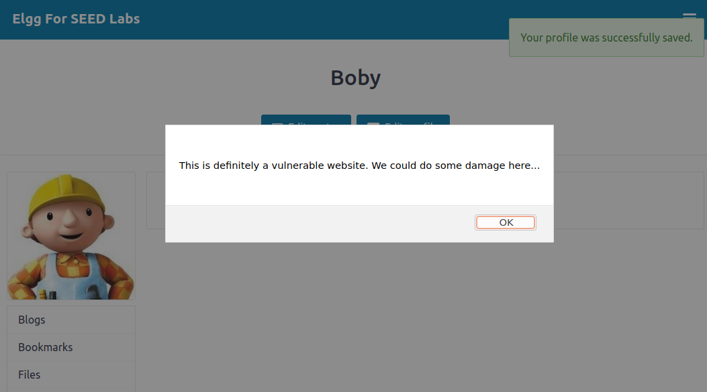
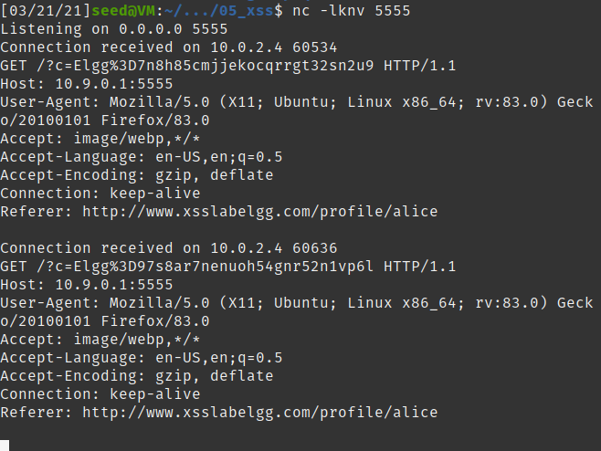

## Lab 05
## Ben Holmgren
## benjamin.holmgren1@student.montana.edu
## CSCI 476
## Due 3/23/2021 (noon)

### Task 1

To begin, we can insert the javascript code which will provide an alert within
the brief description of the user. This is done as follows:

And as a result, we obtain the following output whenever Boby's profile
is accessed, no matter by whom. We see the alert box in the top of the
window, signifying that the browser is indeed running the code we've injected
where input was intended.

Indeed, even when logged in as another user, in this case Alice, the same
alert window pops up.

### Task 2

Next, we simply insert a similar alert in the brief description input section,
but this time we have an alert pop up displaying the cookies of a given browser.

This is done with the following payload:

Delivering the desired output, displaying the browser's cookies at that moment.

### Task 3

Injecting the provided code to send the cookies of a user to a specified port
upon viewing Alice's profile, we are able to view the cookies of users
successfully. This is accomplished upon the following input:

Which realizes the following output on the netcat listening server:

However, all we've done so far has been basically trivial. We want other users
to send their data to us upon visiting Alice's page. Indeed, logging in as Boby,this is the case, where we not only have the output from Alice, but we also
have the cookies from Boby when he views Alice's profile:

Even cooler, we can use a webhook site to provide us the output we'd gotten
previously from netcat. In this way, we can have the exact same capabilities
but just through the world wide web alone. This is accomplished by altering
the code in Alice's profile to the following:

Which provides the resulting in the webhook site:

Importantly, we obtain that user's cookies by prompting the DOM tree
to our webhook url, and as before achieve the desired sensitive information.

### Task 4.1

For this task, all we need to do is insert the provided code into the
about section of Samy's profile. Then, if we insert the correct url into this
code, theoretically anyone who clicks on Samy's profile will automatically
become his friend. Conveniently for our purposes, we find that simply hovering
over the 'Add friend' option for Samy in another user's account (I used Alice),
actually gives us the url that we need for the payload.

With this observation, we craft the following payload within Samy's profile:

And finally, logging out and logging back in as Alice, when we visit Samy's
profile, it appears as though nothing has happened. Then however, once we
check who Alice's friends are, indeed we observe that Samy is her friend now
without Alice actually adding him.

### Task 4.2

If the application had only provided an editor mode, this attack wouldn't work.
We know this to be true, because within editor mode, the input gets wrapped up
in proper html syntax and is just outputted as text, not potentially executed
by the browser. To demonstrate, we take the exact same code that worked in 4.1,
and just insert it into the about section in the editor mode.

We can then quickly verify that the exact same attack won't work when we log in
as another user and visit Samy's profile. We find that this time, we just see
a weird about section in Samy's account, and when viewing our friends, we don't
yet have any in Boby's account.

### Task 5.1

Similarly to in task 4, to modify other users' profiles once they view Samy's,
I constructed content strings in a similar manner to before. Namely, I noticed
that the home address of the editing action occurs at www.xsslabelgg.com/action/profile/edit.
Then, for me finding the content string was the crux here. I noticed in the post request that we
would need to modify the description parameter to our chosen message, as well as including
the token, ts, name, access level, and guid parameters. Here is just a short snippet of what that
post request was giving me in the network tab of the web developer tools in firefox:

Getting the correct ordering in my format
string could've been anybody's guess, so I referenced the course textbook for inspiration.
Finally, we already know Samy's guid from before, so we simply assign that variable to be 59.

All of the above thoughts culminated in the provided payload, where we only altered the three
lines of code which we were prompted to change:

Finally, for supporting evidence, here is the result when another user views Samy's profile.
When viewing Samy's profile as, say, Boby, and then later viewing Boby's profile, we find
the desired message, without editing the profile on our own! Woohoo!

### Task 5.2

Why do we need line (1) in the provided code? Well, so that whatever malicious changes we plan to
bring about on others don't also
happen to our own profile. Taking out that line of code results in the following output on Samy's
profile:

Interestingly, we needed to refresh the page to get this behavior, which hasn't happened so far
with any of the other bugs we've inserted.
However, upon refreshing the page, we do indeed see that the expected behavior of Samy pronouncing
himself a genius is indeed what we find. This makes sense, as we have no kind of guard against this,
as that was the purpose of line (1). At this point, this isn't detrimental, other than that it makes
Samy look like a total narcissist.

However, here's the kicker. Since getting rid of line (1) actually changed the profile of Samy in the
input section which contained the payload we'd crafted, it turns out that when other users
end up viewing Samy, like Alice for example, no changes are impacted on their profile.

Now, if our payload were crafted to affect a different input section, then I think this attack should
still work, albeit also affecting Samy himself. But since the attack is directly affecting user data
in the same location where the payload lies, this has the effect of just erasing the payload, making
the attack ineffective.

### Task 6

Now, we string all of our achievements together from throughout the lab
to create a mega worm, capable of infecting all of elgg. For starters, we
simply copy and paste the code that made us successful earlier. Then, we note
that we don't want to initialize and reuse the same variables twice,
so we rename any variables where there would be overlap otherwise. (For 
example, switch the first Ajax to Aj, etc). The last step we need is to
carefully embed the worm code that's been given to us. We do so by inserting the
wormcode (i.e. all of the code that we've just written) directly inside of
the description text we're inserting, by the same method used in part 5. Adding
in the wormCode variable directly after the chosen message that "Samy
is a god among men", we conclude with the following payload:

Then, we visit Samy's profile as another user, Alice. We then discover that
indeed, Alice has been infected by the worm. Namely, Alice is now friends with
Samy, even though she would never actually befriend him.

And furthermore, Alice has declared that Samy is a god among men on her
profile.

Inspecting Alice's profile, we see the worm code now lingering behind the
scenes in her 'about me' section.

Now, unsuspecting Boby visits Alice's profile. 

We find the desired result, that indeed Boby has now befriended
Samy, without intending to in any way, and without even visiting
Samy's profile.

Lastly, we find that Boby has also in fact posted on his profile that
Samy is a god among men, as we'd hoped! Woohoo, we've created the ultimate
elgg worm!!

