## Lab 06
## Ben Holmgren
## benjamin.holmgren1@student.montana.edu
## CSCI 476
## Due 4/6/2021 (noon)

### Task 1:

For this task, I chose to encrypt data in the form of a wikipedia article on
Russian mystic, Rasputin.

I did so via the three ciphers provided in the prompt, -aes-128-cbc, -bf-cbc,
and -aes-128-cfb. Using the key '001122334455667788991122334455' and the
initialization vector '00010203040506070809A0B0C0D0E0F' for each cipher.

The following includes my sample outputs for each of the three ciphers. I've
left out the jibberish that my file (rasputin.txt) turned into for brevity,
but indeed my output was very much encrypted. If you wish to see them, I'll
link them here:

[c1](cipher1)

[c2](cipher2)

[c3](cipher3)

As for my output:

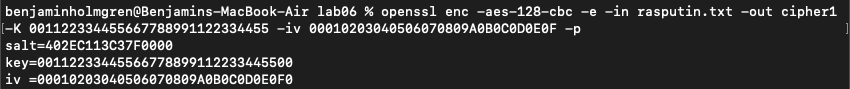

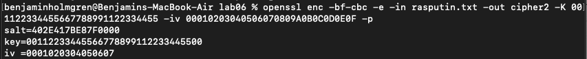

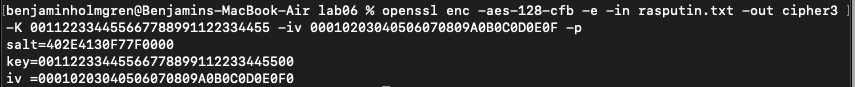

### Task 2

For starters, I downloaded and viewed the picture in my standard macOS preview:

Then I used the recommended commands to encrypt the image using cbc encryption:

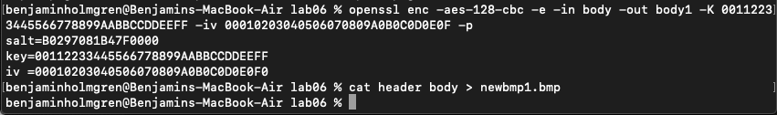

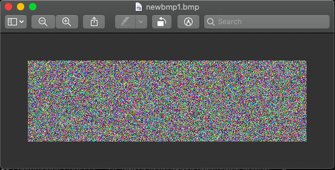

Next I encrypted the image using ecb encryption, which was undoubtedly less
effective as an encryption mechanism:

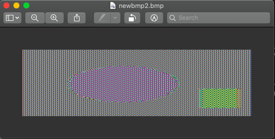

### Task 2.2

For the image of my choice, I used a bitmap of a random image I found on the internet

Here is the result from cbc encryption, and the commands I used:

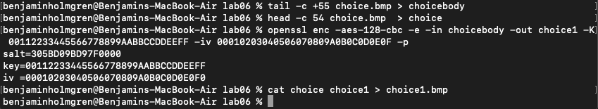

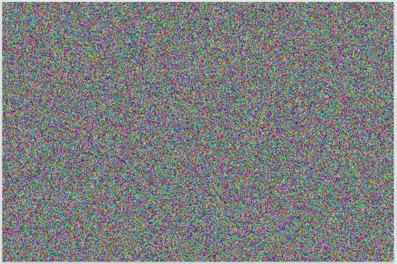

Lastly, here is my command for ebc encryption and the resulting output:

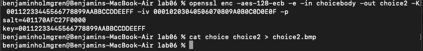

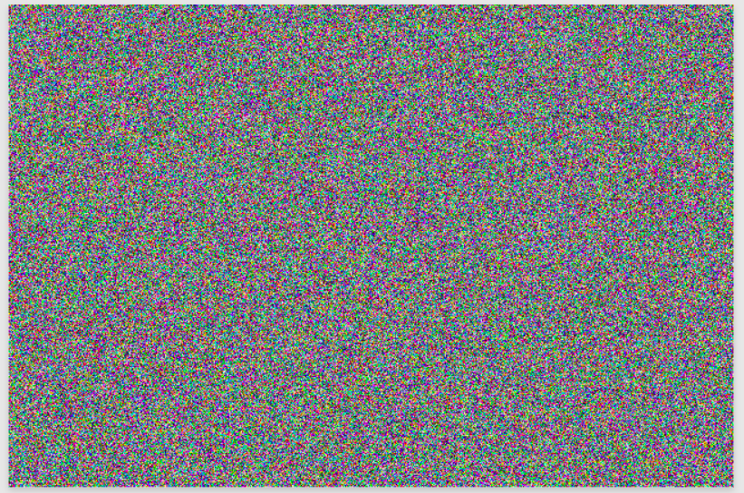

### Task 3.1

First thing's first, I created three files with 5, 10, and 16 bytes respectively:

Then I encrypted the three files in cbc mode:

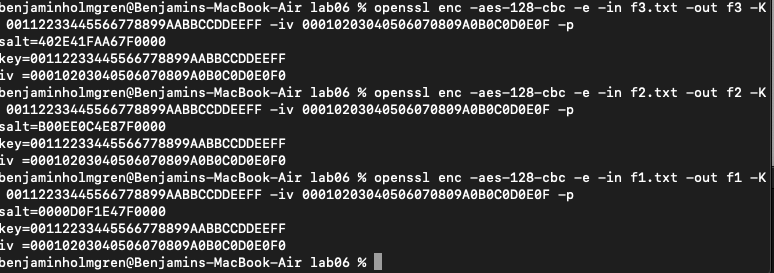

Inspecting their size, we find that the 5 and 10 byte files are now 16 bytes encrypted,
and the 16 byte file is now 32 bytes encrypted.

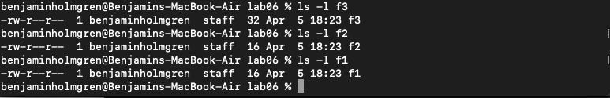

Finally, we can decrypt each of the three files and inspect their contents. Doing so, we
observe that in hex, we have the value of the number of bytes in the file, which is how
the algorithm knows how to get rid of the extra padding in the decryption process.

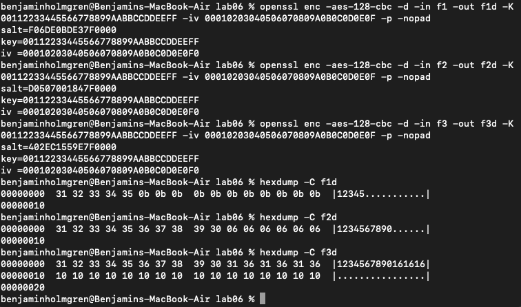

### Task 3.2

Next, I repeated 3.1 with ecb:

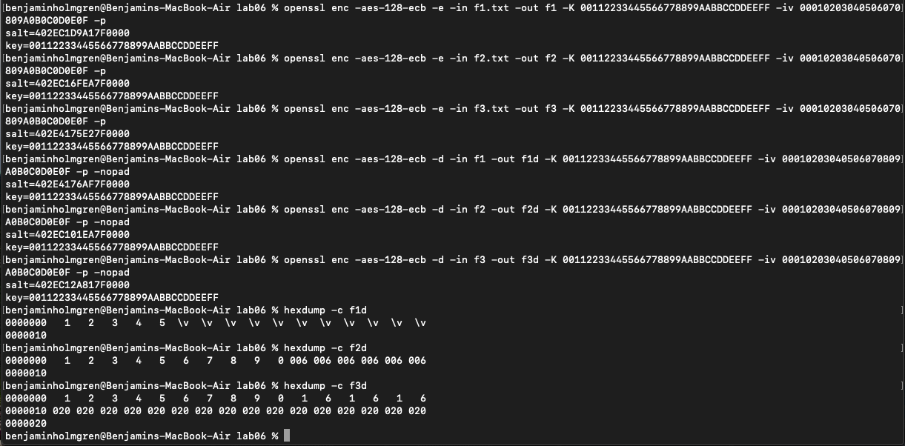

Then I repeated 3.1 with cfb:

And finally, I repeated 3.1 with efb:

Then indeed, for the three methods of encryption that we've attempted, we find that the
only method that uses padding is ECB. In this case, the slots padding our 5 byte file
are filled by \v, the slots padding the 10 byte file are padded by 006, and the slots
padding the 16 byte file contain 020.

OFB and CFB do not need padding
TODO:WHY!!!

### Task 4.1

For some kind of corruption in the encrypted version of the file that intersects with
the original content within the file (i.e. the unpadded portion), it seems as though one
might lose the corrupted data but nothing more. This is only the case if the algorithm's
decryption scheme is able to uniquely decrypt every letter, and not the case if the
algorithm's decryption outcome of one letter influences the decryption outcome of other
characters thereafter. Then in effect we could lose everything following the first
corrupted byte. But so long as the decryption is independent for each character, all we'll
lose out on are the corrupted characters.

So, for the sake of specificity, I'll detail what will happen in each of the following
encryption schemes:

* ECB: ECB works in blocks which aren't dependent on one another, so if a change occurs
in the encrypted version of a block within the original contents of the message, the
decrypted message in the end should be the same as the original, except for the characters
which were corrupted.

* CBC: Because CBC works with block dependency from its use of XOR operations, if a part
of a message is corrupted in its encrypted version, any given block of the decrypted
message is dependent on prior blocks in the original message. Thus, the decrypted version
may be corrupted at any point following the introduced corrupted byte.

* CFB: Similarly to CBC, the encryption of CFB is not parallelizable. This means that
portions of the encrypted version are dependent on other portions. As a result, CFB should
lose our information following a corrupted byte in the encrypted message, since the
contents of the message being decrypted are assumed to be a result of prior characters.

* OFB: Since OFB is non parallelizable in both encryption and decryption, it must
lose out on the contents following a corrupted byte, since in both encryption and
decryption, any given portion of a the message is dependent on earlier portions.

For some kind of corruption in the padded content in the encrypted file, we may have a
more complex outcome. In all likelihood, the content of the padded file will emerge in the
decrypted version, so we'll simply have a bunch of nonsense tacked on to the end of our
original content. We know this, because the padded content of the encrypted file tells
the decryption program what values can be dropped in the final version. It seems possible
that we might interfere with this by corrupting this portion of the file, so in the worst
case, we'd have a full string containing padded values and a corrupted value mixed in
somewhere in our final output. However, I wouldn't expect this result to force our
original content to be effected at all. Furthermore, we shouldn't see this kind of issue
when using OFB and CFB, since neither of the two methods use padding in the first place.
We will see if my hypotheses holds up in practice.

### Task 4.2

I created a file with 1000 bytes entirely containing the word 'yeehaw':

