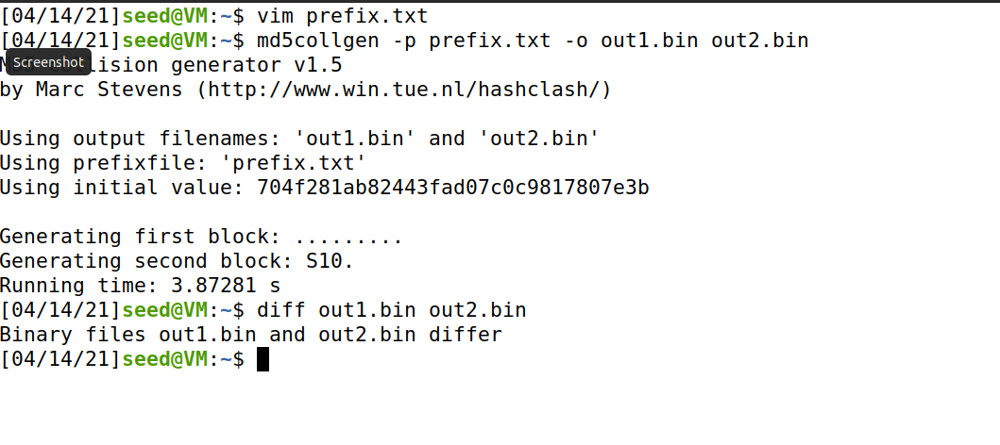
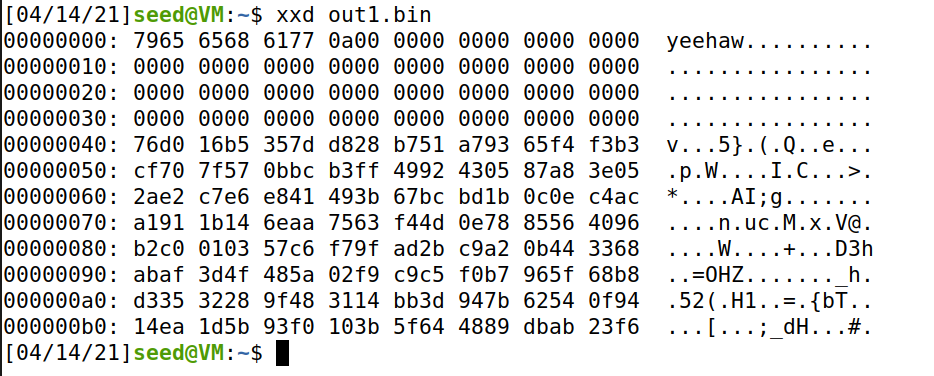
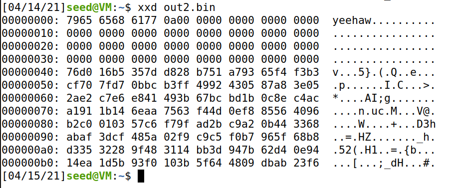
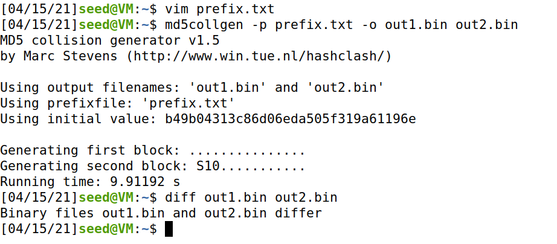
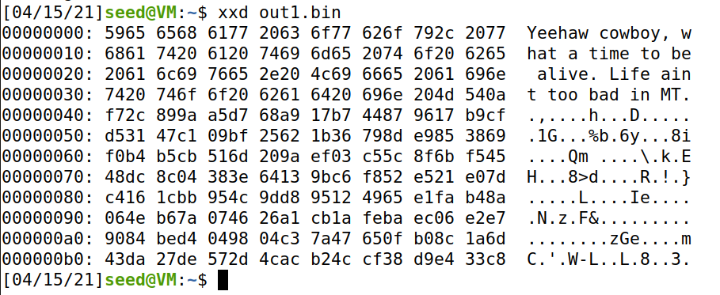
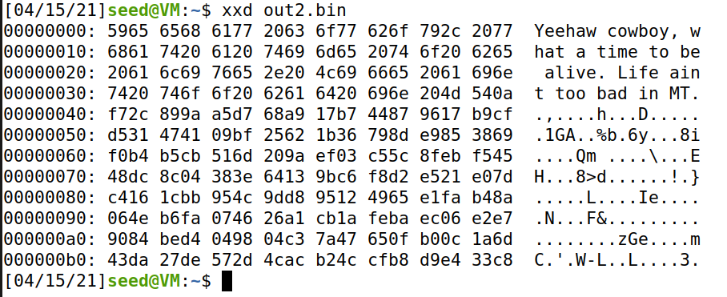
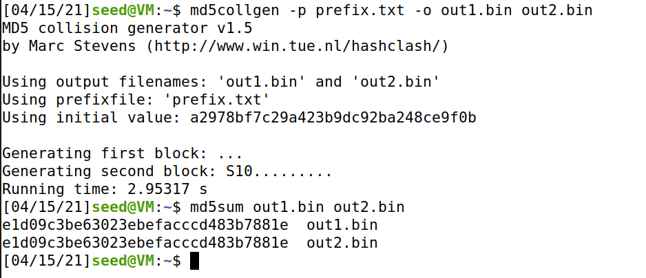
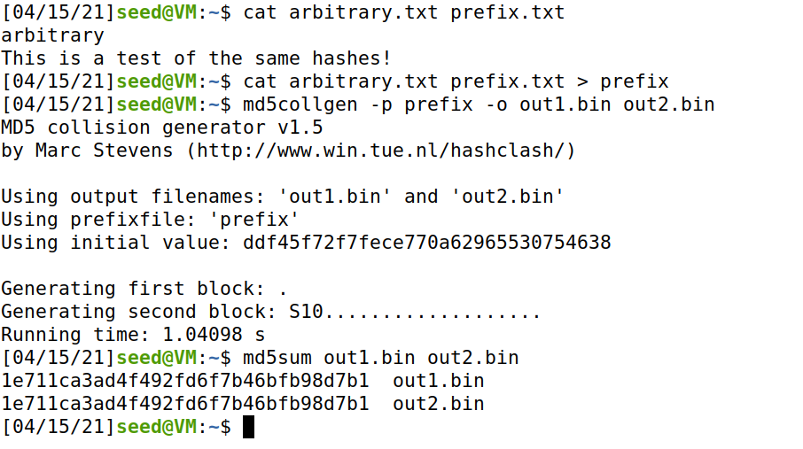
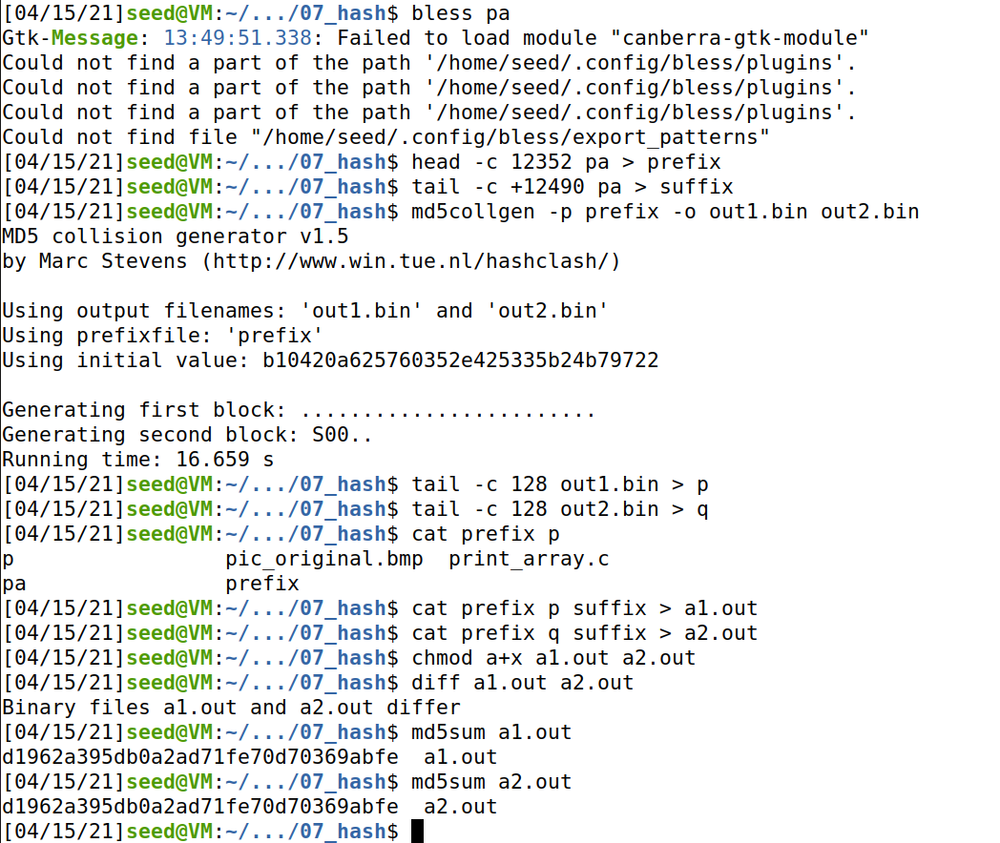
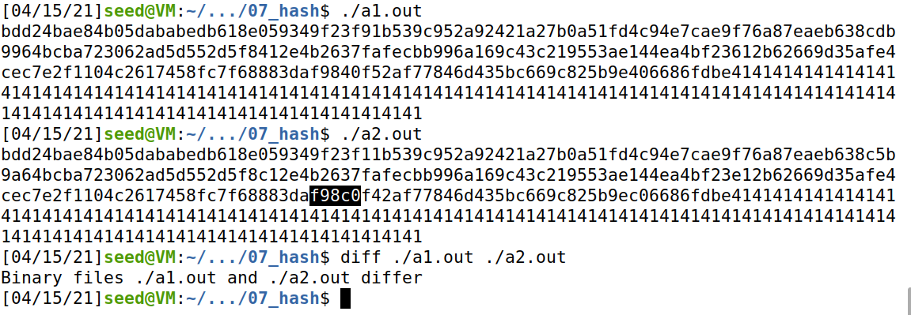

## Lab 07
## Ben Holmgren
## benjamin.holmgren1@student.montana.edu
## CSCI 476
## Due 4/13/2021 (noon)

### Task 1.1

Running the provided commands, we observe that the prefix file once sent to an
MD5 hash in each output file yields two different outputs.

When observing the contents of the two output files, we find that each output
indeed retains the original contents of the prefix.txt file, and each output
also has a sizeable region padded with zeros. Yet, we observe that following the
padded regions, the two output files retain slightly different contents.

### Task 1.2

Based on the above outputs, both of which were the result of an input file
containing fewer than 64 bytes, we can observe that padding occurs.
Namely, the file will be padded with zeros, precisely up to the 64th bit.

### Task 1.3

First and foremost, we see that again the two output files differ.

Along with that, we also see that the two output files both no longer contain
a whole slew of zeros for padding. Rather, since all 64 bytes are filled, the
algorithm doesn't utilize any padding.

### Task 1.4

No, not all bytes differ. Referencing 1.3, we see in this instance that, as 
expected, the original message is maintained in both outputs. The only
differences between the two output files come in bytes 84, 110, 124, 148, and 188.
Interestingly, if we run the experiment again, we don't find that the same
bytes are necessarily different, though there are certainly still a few different
bytes in the two output files.

### Task 2.1

Here, we're tasked with testing the property that MD5 acting on two different
inputs that produce the same output hash also output the same hash when
concatenated by the same thing. Thus, we proceed by finding two
inputs that yield an identical hash. Note that, as mentioned in task 1, we find
the hash using the md5sum command as follows, where the same input has generated
the same hash for two subsequent outputs:

Then, if we concatenate the output files with some arbitrary string (the
test "arbitrary" contained in 'arbitrary.txt), we can 
check the md5 hashes of both output files after running them through
the md5 algorithm again and discover that they indeed remain the same.

### Task 3

To start, I inserted the array containing all "A"'s as indicated by the prompt.
Then, I compiled this and found that the offset of the start of the array was
at byte 4160 using bless. Then I used the collision generator to locate where
md5 would have collisions in my prefix, which contained the the entire compiled
version of the program up to byte 4288. (For this, I used 'tail'). Then, on the
collision's output, I recovered everything following the 128th byte onward in
each version. Then I could simple concatenate the prefix, each of the collided
segments (denoted P and Q), and then confirm that the binary files differed, while
the hash for each file remained consistent.

As evidence, here are the commands I used to execute the task successfully:

And as a final verification, indeed, our a1.out and a2.out files produce a
different output. The changes may be subtle, though I highlighted one in the
screenshot as proof of concept.

### Task 4

