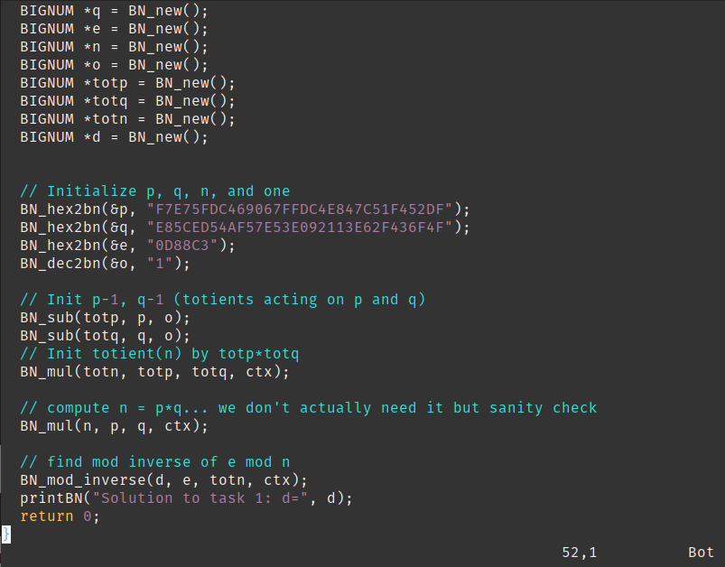
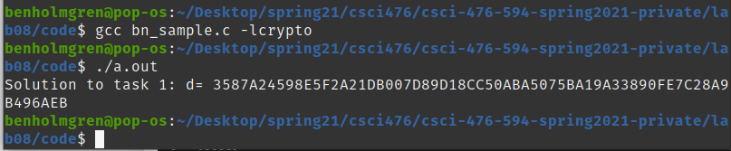
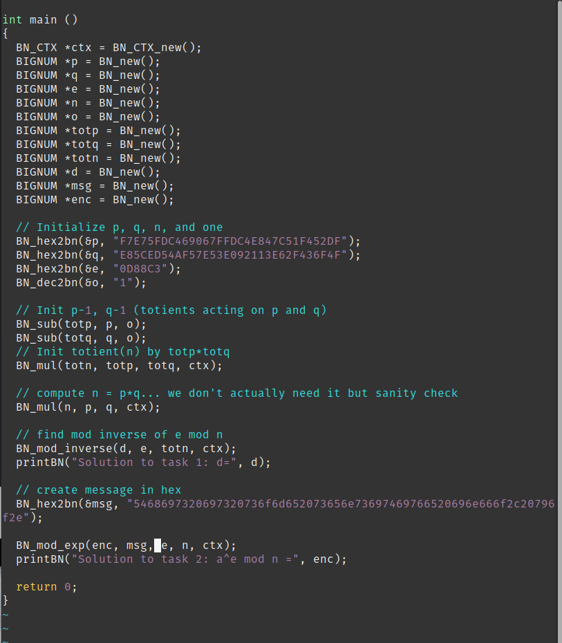
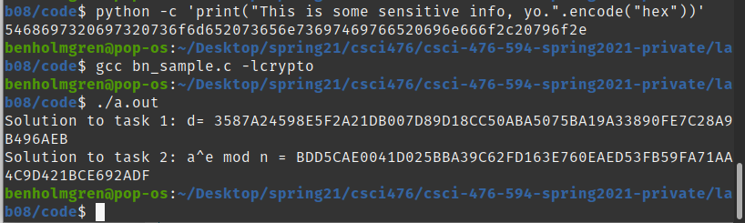
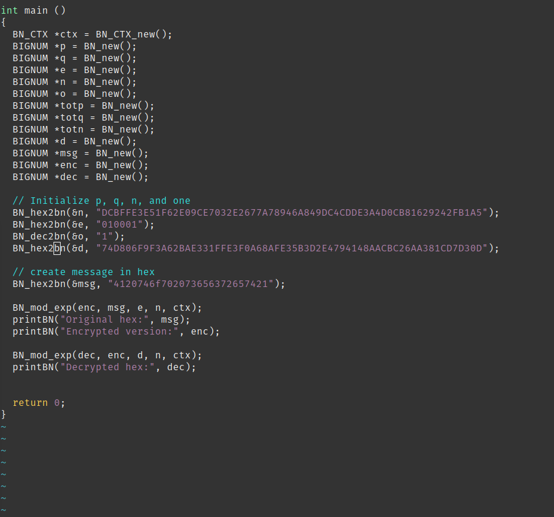
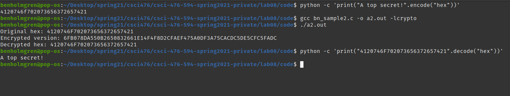
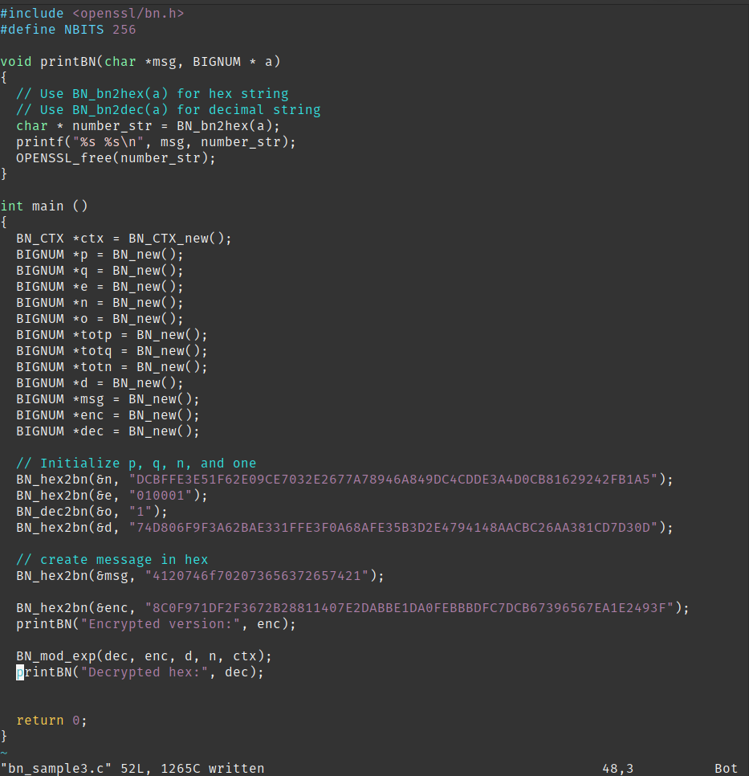
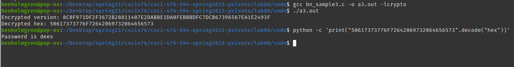

## Lab 08
## Ben Holmgren
## benjamin.holmgren1@student.montana.edu
## CSCI 476
## Due 4/20/2021 (noon)

### Task 1

To begin, we know from the provided materials and (especially helpful this
go around) the reading, that if $k$ is a prime number, Euler's totient function
acting on $k$ is equivalent to $k-1$. For our purposes, we need to compute 
Euler's totient acting on $n$. This is equivalent to $(p-1)(q-1)$. Now
using Euler's theorem, we can obtain a modular inverse for the other component
$e$ of our public key by taking $e^\rho{n}$. Luckily, this has already been
implemented for us with the BN_mod_inverse() function, which we use to obtain
the following code:

Indeed, we find that using the provided p, q, and e, we can derive the private
key d, and find it in the following output:

### Task 2

We proceed in task 2 as instructed by the prompt, by first converting an
ASCII string to hex. Then we'll recall that encrypting a message $a$ amounts to
computing $a^e mod n$. This yields the following code:

Which was the result of the following commands, and produced the following
output:

Effectively encrypting a message that we desired. For the sake of
consistency, I'll now encrypt the message provided in the prompt,
just so that it can be verified quickly that I'm doing this correctly.

Here's the code to simply encrypt the message from the prompt, using the keys
as they're specified. This also decrypts the encrypted version to check that
we're doing it right. So I believe technically, this also solves task 3.
Regardless, here's the code I used:

And here's the resulting output, easily verifiable to be correctly encrypted.

### Task 3

Citing task 2 for methods, we can go forward in virtually the same manner,
decrypting an encrypted message m by computing $m^d mod n$. In the provided
API, this follows in the code below:

And thus, we obtain the following output:

From that, we gain that the underlying message was originally 'Password is
dees".

### Note
Thus concludes my work for lab08. If interested, my code from the lab 
can be found in the code/ directory included with this README.

